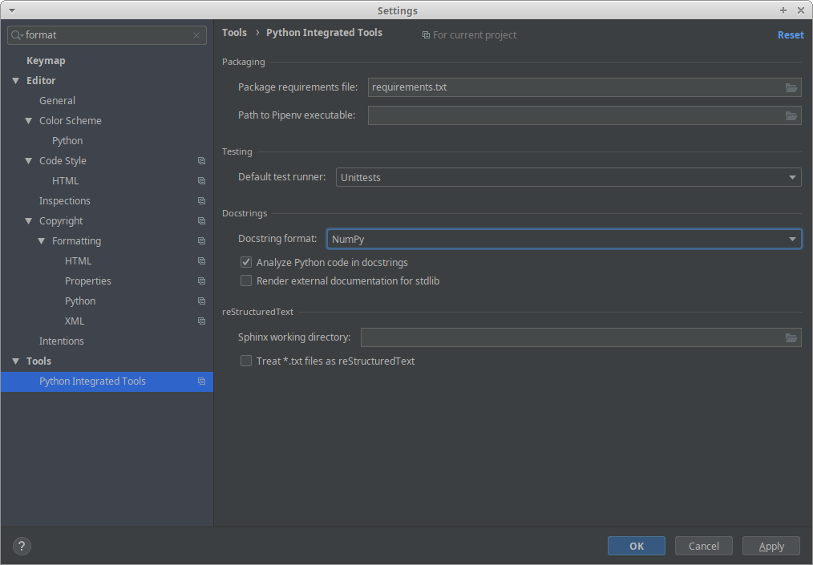

===================
Contributing to MVS
===================

Proposed workflow
-----------------
The workflow is described in the  `CONTRIBUTING.md file<https://github.com/rl-institut/mvs_eland/blob/dev/CONTRIBUTING.md>`_ in the repository.

Unit tests (pytests)
--------------------

When developing code for the MVS please make sure that you always also develop test in `tests`. We integrate those unit tests with `pytest`. 
Make sure that your tests are as leightweight as possible - this means that you do not always have to run the whole code to test for one feature, but can test a function with a standalone tests. Please refer to the other tests that have already been introduced.

Always aim for the test coverage button on `the main page of the github reprository <https://github.com/rl-institut/mvs_eland/>`_ to reach 100%!

When you do have to run the MVS itself for a test, eg. for benchmark tests, please always use the agruments `-f -log warning` to make the test results better readable.

Build documentation
-------------------

You can build the documentation locally moving inside the `docs/` folder and typing

.. code-block:: bash

    html build

into a console, then go to `docs/_build/` and open `index.html` into your favorite browser.

All functions in the code will be automatically documented via their docstrings. Please make sure they follow the `Numpy format <https://numpydoc.readthedocs.io/en/latest/format.html>`_.

Here is how to set that in pycharm

