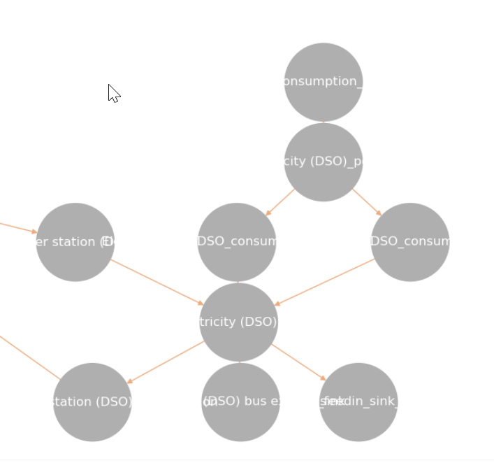
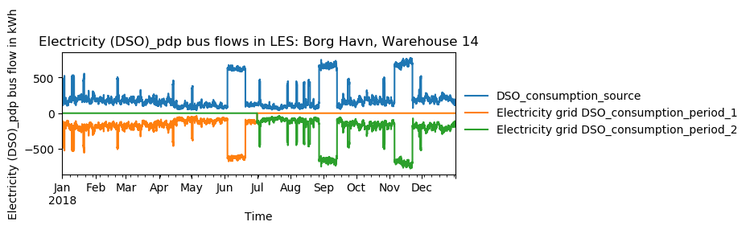

================================
Moddeling Assumptions of the MVS
================================

Component models
----------------

The component models of the MVS result from the used python-library `oemof-solph` for energy modeling.

It requires component models to be simplified and linearized.
This is the reason that the MVS can provide a pre-feasibility study of a specific system setup,
but not the final sizing and system design.
The types of assets are presented below.

Non-dispatchable sources of generation
######################################

`Examples`:

    - PV plant
    - Wind plant

Dispatchable sources of generation
##################################

`Examples`:

    - Fuel sources
    - Run-of-the-river hydro power plant
    - Deep-ground geothermal plant (ground assumed to allow unlimited extraction of heat, not depending on season)

Dispatchable conversion assets
##############################
`Examples`:
    - Diesel generator
    - Electric transformers (rectifiers, inverters)

Energy excess
#############

An energy excess sink is placed on each of the LES energy busses, and therefore energy excess is allowed to take place on each bus of the LES.
This means that there are assumed to be sufficient vents (heat) or transistors (electricity) to dump excess (waste) generation.
Excess generation can only take place when a non-dispatchable source is present or if an asset can supply energy without any fuel or dispatch costs.

Energy providers (DSOs)
-----------------------

The energy providers are the most complex assets in the MVS model. They are composed of a number of sub-assets

    - Energy consumption source, providing the energy required from the system with a certain price
    - Energy peak demand pricing "transformers", which represent the costs induced due to peak demand
    - Bus connecting energy consumption source and energy peak demand pricing transformers
    - Energy feed-in sink, able to take in generation that is provided to the DSO for revenue
    - Optionally: Transformer Station connecting the DSO bus to the energy bus of the LES

With all these components, the DSO can be vizualized as follows:

Variable energy consumption prices (timeseries)
###############################################

- Link to howto

Peak demand pricing
###################

A peak demand pricing scheme is based on an electricity tariff,
that requires the consumer not only to pay for the aggregated energy consumption in a time period (eg. kWh electricity),
but also for the maximum peak demand (load, eg. kW power) towards the DSO grid within a specific pricing period.

In the MVS, this information is gathered for the `energyProviders` with:

    - :const:`src.constants_json_strings.PEAK_DEMAND_PRICING_PERIOD` as the period used in peak demand pricing. Possible is 1 (yearly), 2 (half-yearly), 3 (each trimester), 4 (quaterly), 6 (every 2 months) and 12 (each month). If you have a `simulation_duration` < 365 days, the periods will still be set up assuming a year! This means, that if you are simulating 14 days, you will never be able to have more than one peak demand pricing period in place.

    - :const:`src.constants_json_strings.PEAK_DEMAND_PRICING` as the costs per peak load unit, eg. kW

To repesent the peak demand pricing, the MVS adds a "transformer" that is optimized with specific operation and maintainance costs per year equal to the PEAK_DEMAND_PRICING for each of the pricing periods.
For two peak demand pricing persiods, the resulting dispatch could look as following:

Limitations
-----------

Perfect foresight
#################
- Battery charge

Infeasible dispatch of assets
#############################

- Energy consumption and feed-in at the same time
- Bi-directional inverters
