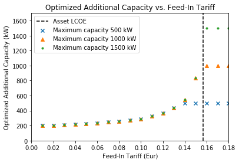

================================
Modeling Assumptions of the MVS
================================

Cost calculations
-----------------

The optimization in the MVS is mainly a cost optimization. There are some additional constraints that can be introduced, mainly by adding bounds eg. by limiting the maximum capacity that can be installed (comp. :ref:`maxcap-label`) or adding constraints for certain key performance indicators (see :ref:`constraints-label`). To optimize the energy systems properly, the economic data provided with the input data has to be pre-processed (also see :ref:`economic_precalculation-label`) and then also post-processed when evaluating the results. Following assumptions are important:

* **Project lifetime**: The simulation has a defined project lifetime, for which continuous operation is assumed - which means that the first year of operation is exactly like the last year of operation. Existing and optimized assets have to be replaced to make this possible.
* **Simulation duration**: It is advisable to simulate whole year to find the most suitable combination of energy assets for your system. Sometimes however you might want to look at specific seasons to see their effect - this is possible in the MVS by choosing a specific start date and simulation duration.
* **Asset costs**: Each asset can have development costs, specific investment costs, specific operation and management costs as well as dispatch costs.
    * *Replacement costs* are calculated based on the lifetime of the assets, and residual values are paid at the end of the project.
    * *Development costs* are costs that will occurr regardless of the installed capacity of an asset - even if it is not installed at all. It stands for system planning and licensing costs. If you have optimized your energy system and see that an asset might not be favourable (zero optimized capacities), you might want to run the simulation again and remove the asset, or remove the development costs of the asset.
    * *Specific investment costs* and *specific operation and maintenance costs* are used to calculate the annual expenditures that an asset has per year, in the process also adding the replacement costs.
    * *Dispatch price* can often be set to zero, but are supposed to cover instances where utilization of an asset requires increased operation and maintenance or leads to wear.
* **Pre-existing capacities**: It is possible to add assets that already exist in your energy system with their capacity and age.
    * *Replacements* - To ensure that the energy system operates continously, the existing assets are replaced with the same capacities when they reached their end of life within the project lifetime.
    * *Replacement costs* are calculated based on the lifetime of the asset in general and the age of the pre-existing capacities
* **Fix project costs**: It is possible to define fix costs of the project - this is important if you want to compare different project locations with each other. You can define...
    * *Development costs*, which could for example stand for the cost of licenses of the whole energy system
    * *(Specific) investment costs*, which could be an investment into land or buildings at the project site. When you define a lifetime for the investment, the MVS will also consider replacements and reimbursements.
    * *(Specific) operation and management costs*, which can cover eg. the salaries of at the project site


Component models
----------------

The component models of the MVS result from the used python-library `oemof-solph` for energy modeling.

It requires component models to be simplified and linearized.
This is the reason that the MVS can provide a pre-feasibility study of a specific system setup,
but not the final sizing and system design.
The types of assets are presented below.


Energy Production
#################

Non-dispatchable sources of generation
======================================

`Examples`:

    - PV plant
    - Wind plant

Dispatchable sources of generation
==================================

`Examples`:

    - Fuel sources
    - Run-of-the-river hydro power plant
    - Deep-ground geothermal plant (ground assumed to allow unlimited extraction of heat, not depending on season)

Fuel sources are added as dispatchable sources, which still can have development, investment, operational and dispatch costs.
They are added by adding a column in `energyProviders.CSV`, and setting file_name to `None`.

Energy providers, even though also dispatchable sources of generation, should be added via `energyProviders.csv`,
as there are some additional features available then.

Both energy providers and the additional fuel sources are limited to the options provided in the table of :ref:`table_default_energy_carrier_weights_label`, as the default weighting factors to translate the energy carrier into electricity equivalent need to be defined.


.. _energy_conversion:

Energy conversion
#################

`Examples`:

    - Diesel generator
    - Electric transformers (rectifiers, inverters)
    - Heat pumps (as heater and/or chiller)


Conversion assets are added as transformers and are defined in `energyConversion.csv`.

The parameters `dispatch_price`, `efficiency` and `installedCap` of transformers are assigned to the output flows.
This means that these parameters need to be given for the electrical output power in case of a diesel generator (more examples: electrolyzer - H2, heat pumps and boiler - nominal heat output, inverters / rectifiers - electrical output power).
This also means that the costs of the fuel of a diesel generator (input flow) are not included in its `dispatch_price` but in the `dispatch_price` of the fuel source.

Charge controllers for a :ref:`battery_storage` are defined by two transformers, one for charging and one for discharging.

When using two conversion objects to emulate a bidirectional conversion assets, their capacity should be interdependent. This is currently not the case, see `Infeasible bi-directional flow in one timestep <https://multi-vector-simulator.readthedocs.io/en/stable/Model_Assumptions.html#infeasible-bi-directional-flow-in-one-timestep>`_.

Heating, Ventilation, and Air Conditioning (HVAC)
=================================================

Like other conversion assets, devices for heating, ventilation and air conditioning (HVAC) are added as transformers. As the parameters `dispatch_price`, `efficiency` and `installedCap` are assigned to the output flows they need to be given for the nominal heat output of the HVAC.

Different types of HVAC can be modelled. Except for an air source device with ambient temperature as heat reservoir, the device could be modelled with two inputs (electricity and heat) in case the user is interested in the heat reservoir. This has not been tested, yet, also note that, currently efficiencies are assigned to the output flows the see `issue #799 <https://github.com/rl-institut/multi-vector-simulator/issues/799>`_

The efficiency of HVAC systems is defined by the coefficient of performance (COP), which is strongly dependent on the temperature. In order to take account of this, the efficiency can be defined as time series, see section :ref:`time_series_params`.
If you do not provide your own COP time series you can calculate them with `oemof.thermal <https://github.com/oemof/oemof-thermal>`_, see  `documentation on compression heat pumps and chillers <https://oemof-thermal.readthedocs.io/en/stable/compression_heat_pumps_and_chillers.html>`_ and  `documentation on absorption chillers <https://oemof-thermal.readthedocs.io/en/stable/absorption_chillers.html>`_.


Energy providers
################

The energy providers are the most complex assets in the MVS model. They are composed of a number of sub-assets

    - Energy consumption source, providing the energy required from the system with a certain price
    - Energy peak demand pricing "transformers", which represent the costs induced due to peak demand
    - Bus connecting energy consumption source and energy peak demand pricing transformers
    - Energy feed-in sink, able to take in generation that is provided to the energy provider for revenue
    - Optionally: Transformer Station connecting the energy provider bus to the energy bus of the LES

With all these components, the energy provider can be visualized as follows:

.. image:: images/Model_Assumptions_energyProvider_assets.png
 :width: 600

Variable energy consumption prices (time-series)
================================================

- Link to howto

Peak demand pricing
===================

A peak demand pricing scheme is based on an electricity tariff,
that requires the consumer not only to pay for the aggregated energy consumption in a time period (eg. kWh electricity),
but also for the maximum peak demand (load, eg. kW power) towards the grid of the energy provider within a specific pricing period.

In the MVS, this information is gathered for the `energyProviders` with:

    - :const:`multi_vector_simulator.utils.constants_json_strings.PEAK_DEMAND_PRICING_PERIOD` as the period used in peak demand pricing. Possible is 1 (yearly), 2 (half-yearly), 3 (each trimester), 4 (quaterly), 6 (every 2 months) and 12 (each month). If you have a `simulation_duration` < 365 days, the periods will still be set up assuming a year! This means, that if you are simulating 14 days, you will never be able to have more than one peak demand pricing period in place.

    - :const:`multi_vector_simulator.utils.constants_json_strings.PEAK_DEMAND_PRICING` as the costs per peak load unit, eg. kW

To represent the peak demand pricing, the MVS adds a "transformer" that is optimized with specific operation and maintenance costs per year equal to the PEAK_DEMAND_PRICING for each of the pricing periods.
For two peak demand pricing periods, the resulting dispatch could look as following:

.. image:: images/Model_Assumptions_Peak_Demand_Pricing_Dispatch_Graph.png
 :width: 600


Energy storage
##############

Energy storages such as battery storages, thermal storages or H2 storages are modelled with the *GenericStorage* component of *oemof.solph*. They are designed for one input and one output and are defined with files `energyStorage.csv` and `storage_*.csv` and have several parameters, which are listed in the section :ref:`storage_csv`.

The state of charge of a storage at the first and last time step of an optimization are equal.
Charge and discharge of the whole capacity of the energy storage are possible within one time step in case the capacity of the storage is not optimized. In case of
capacity optimization charge and discharge is limited by the :ref:`crate-label`.

.. _battery_storage:

Battery energy storage system (BESS)
====================================

BESS are modelled as *GenericStorage* like described above. The BESS can either be connected directly to the electricity bus of the LES or via a charge controller that manages the BESS.
When choosing the second option, the capacity of the charge controller can be optimized individually, which takes its specific costs and lifetime into consideration.
If you do not want to optimize the charge controller's capacity you can take its costs and efficiency into account when defining the storage's input and output power, see :ref:`storage_csv`.
A charge controller is defined by two transformers, see section :ref:`energy_conversion` above.

Note that capacity reduction over the lifetime of a BESS that may occur due to different effects during aging cannot be taken into consideration in MVS. A possible workaround for this could be to manipulate the lifetime.

Thermal energy storage
======================

Thermal energy storages of the type sensible heat storage (SHS) are modelled as *GenericStorage* like described above. The implementation of a specific type of SHS, the stratified thermal energy storage, is described in section :ref:`stratified_tes`.
The modelling of latent-heat (or Phase-change) and chemical storages have not been tested with MVS, but might be achieved by precalculations.

H2 storage
==========

tba

.. _stratified_tes:

Stratified thermal energy storage
=================================

Stratified thermal energy storage is defined by the two optional parameters `fixed_losses_relative` and `fixed_losses_absolute`. If they are not included in `storage_*.csv` or are equal to zero, then a normal generic storage is simulated.
These two parameters are used to take into account temperature dependent losses of a thermal storage. To model a thermal energy storage without stratification, the two parameters are not set. The default values of `fixed_losses_relative` and `fixed_losses_absolute` are zero.
Except for these two additional parameters the stratified thermal storage is implemented in the same way as other storage components.

Precalculations of the `installedCap`, `efficiency`, `fixed_losses_relative` and `fixed_losses_absolute` can be done orientating on the stratified thermal storage component of `oemof.thermal  <https://github.com/oemof/oemof-thermal>`__.
The parameters `U-value`, `volume` and `surface` of the storage, which are required to calculate `installedCap`, can be precalculated as well.

The efficiency :math:`\eta` of the storage is calculated as follows:

.. math::
   \eta = 1 - loss{\_}rate

This example shows how to do precalculations using stratified thermal storage specific input data:


.. code-block:: python

        from oemof.thermal.stratified_thermal_storage import (
        calculate_storage_u_value,
        calculate_storage_dimensions,
        calculate_capacities,
        calculate_losses,
        )

        # Precalculation
        u_value = calculate_storage_u_value(
            input_data['s_iso'],
            input_data['lamb_iso'],
            input_data['alpha_inside'],
            input_data['alpha_outside'])

        volume, surface = calculate_storage_dimensions(
            input_data['height'],
            input_data['diameter']
        )

        nominal_storage_capacity = calculate_capacities(
            volume,
            input_data['temp_h'],
            input_data['temp_c'])

        loss_rate, fixed_losses_relative, fixed_losses_absolute = calculate_losses(
            u_value,
            input_data['diameter'],
            input_data['temp_h'],
            input_data['temp_c'],
            input_data['temp_env'])

Please see the `oemof.thermal` `examples <https://github.com/oemof/oemof-thermal/tree/dev/examples/stratified_thermal_storage>`__ and the `documentation  <https://oemof-thermal.readthedocs.io/en/latest/stratified_thermal_storage.html>`__ for further information.

For an investment optimization the height of the storage should be left open in the precalculations and `installedCap` should be set to 0 or NaN.

An implementation of the stratified thermal storage component has been done in `pvcompare <https://github.com/greco-project/pvcompare>`__. You can find the precalculations of the stratified thermal energy storage made in `pvcompare` `here <https://github.com/greco-project/pvcompare/tree/dev/pvcompare/stratified_thermal_storage.py>`__.


Energy excess
#############

.. note::
   Energy excess components are implemented **automatically** by MVS! You do not need to define them yourself.

An energy excess sink is placed on each of the LES energy busses, and therefore energy excess is allowed to take place on each bus of the LES.
This means that there are assumed to be sufficient vents (heat) or transistors (electricity) to dump excess (waste) generation.
Excess generation can only take place when a non-dispatchable source is present or if an asset can supply energy without any fuel or dispatch costs.

In case of excessive excess energy, a warning is given that it seems to be cheaper to have high excess generation than investing into more capacities.
High excess energy can for example result into an optimized inverter capacity that is smaller than the peak generation of installed PV.
This becomes unrealistic when the excess is very high.

.. _constraints-label:

Constraints
-----------

Constraints are controlled with the file `constraints.csv`.

Minimal renewable factor constraint
###################################

The minimal renewable factor constraint requires the capacity and dispatch optimization of the MVS to reach at least the minimal renewable factor defined within the constraint. The renewable share of the optimized energy system may also be higher than the minimal renewable factor.

The minimal renewable factor is applied to the minimal renewable factor of the whole, sector-coupled energy system, but not to specific sectors. As such, energy carrier weighting plays a role and may lead to unexpected results. The constraint reads as follows:

.. math::
        minimal renewable factor <= \frac{\sum renewable generation \cdot weighting factor}{\sum renewable generation \cdot weighting factor + \sum non-renewable generation \cdot weighting factor}

Please be aware that the minimal renewable factor constraint defines bounds for the :ref:`kpi_renewable_factor` of the system, ie. taking into account both local generation as well as renewable supply from the energy providers. The constraint explicitly does not aim to reach a certain :ref:`kpi_renewable_share_of_local_generation` on-site.

:Deactivating the constraint:

The minimal renewable factor constraint is deactivated by inserting the following row in `constraints.csv` as follows:

```minimal_renewable_factor,factor,0```

:Activating the constraint:

The constraint is enabled when the value of the minimal renewable factor factor is above 0 in `constraints.csv`:

```minimal_renewable_factor,factor,0.3```


Depending on the energy system, especially when working with assets which are not to be capacity-optimized, it is possible that the minimal renewable factor criterion cannot be met. The simulation terminates in that case. If you are not sure if your energy system can meet the constraint, set all `optimize_Cap` parameters to `True`, and then investigate further.
Also, if you are aiming at very high minimal renewable factors, the simulation time can increase drastically. If you do not get a result after a maximum of 20 Minutes, you should consider terminating the simulation and trying with a lower minimum renewable share.

The minimum renewable share is introduced to the energy system by `D2.constraint_minimal_renewable_share()` and a validation test is performed with `E4.minimal_renewable_share_test()`.

Minimal degree of autonomy constraint
######################################

The minimal degree of autonomy constraint requires the capacity and dispatch optimization of the MVS to reach at least the minimal degree of autonomy defined within the constraint. The degree of autonomy of the optimized energy system may also be higher than the minimal degree of autonomy. Please find the definition of here: :ref:`kpi_degree_of_autonomy`

The minimal degree of autonomy is applied to the whole, sector-coupled energy system, but not to specific sectors. As such, energy carrier weighting plays a role and may lead to unexpected results. The constraint reads as follows:

.. math::
        minimal~degree~of~autonomy <= DA = \frac{\sum E_{demand,i} \cdot w_i - \sum E_{consumption,provider,j} \cdot w_j}{\sum E_{demand,i} \cdot w_i}

:Deactivating the constraint:

The minimal degree of autonomy constraint is deactivated by inserting the following row in `constraints.csv` as follows:

```minimal_degree_of_autonomy,factor,0```

:Activating the constraint:

The constraint is enabled when the value of the minimal degree of autonomy is above 0 in `constraints.csv`:

```minimal_degree_of_autonomy,factor,0.3```


Depending on the energy system, especially when working with assets which are not to be capacity-optimized, it is possible that the minimal degree of autonomy criterion cannot be met. The simulation terminates in that case. If you are not sure if your energy system can meet the constraint, set all `optimizeCap` parameters to `True`, and then investigate further.

The minimum degree of autonomy is introduced to the energy system by `D2.constraint_minimal_degree_of_autonomy()` and a validation test is performed with `E4.minimal_degree_of_autonomy()`.


Maximum emission constraint
###########################

The maximum emission constraint limits the maximum amount of total emissions per year of the energy system. It allows the capacity and dispatch optimization of the MVS to result into a maximum amount of emissions defined by the maximum emission constraint. The yearly emissions of the optimized energy system may also be lower than the maximum emission constraint.

Please note that the maximum emissions constraint currently does not take into consideration life cycle emissions, also see :ref:`emissions` section for an explanation.

:Activating the constraint:

The maximum emissions constraint is enabled by inserting the following row in `constraints.csv` as follows:

```maximum_emissions,kgCO2eq/a,800000```

:Deactivating the constraint:

The constraint is deactivated by setting the value in `constraints.csv` to None:

```maximum_emissions,kgCO2eq/a,None```

The unit of the constraint is `kgCO2eq/a`. To select a useful value for this constraint you can e.g.:

- Firstly, optimize your system without the constraint to get an idea about the scale of the emissions and then, secondly, set the constraint and lower the emissions step by step until you receive an unbound problem (which then represents the non-archievable minimum of emissions for your energy system)
- Check the emissions targets of your region/country and disaggregate the number

The maximum emissions constraint is introduced to the energy system by `D2.constraint_maximum_emissions()` and a validation test is performed within the benchmark tests.


Weighting of energy carriers
----------------------------

To be able to calculate sector-wide key performance indicators, it is necessary to assign weights to the energy carriers based on their usable potential. In the conference paper handed in to the CIRED workshop, we have proposed a methodology comparable to Gasoline Gallon Equivalents.

After thorough consideration, it has been decided to base the equivalence in tonnes of oil equivalent (TOE). Electricity has been chosen as a baseline energy carrier, as our pilot sites mainly revolve around it and also because we believe that this energy carrier will play a larger role in the future. For converting the results into a more conventional unit, we choose crude oil as a secondary baseline energy carrier. This also enables comparisons with crude oil price developments in the market. For most KPIs, the baseline energy carrier used is of no relevance as the result is not dependent on it. This is the case for KPIs such as the share of renewables at the project location or its self-sufficiency. The choice of the baseline energy carrier is relevant only for the levelized cost of energy (LCOE), as it will either provide a system-wide supply cost in Euro per kWh electrical or per kg crude oil.

First, the conversion factors to kg crude oil equivalent [`1  <https://www.bp.com/content/dam/bp/business-sites/en/global/corporate/pdfs/energy-economics/statistical-review/bp-stats-review-2019-approximate-conversion-factors.pdf>`__] were determined (see :ref:`table_kgoe_conversion_factors` below). These are equivalent to the energy carrier weighting factors with baseline energy carrier crude oil.

Following conversion factors and energy carriers are defined:

.. _table_kgoe_conversion_factors:

.. list-table:: Conversion factors: kg crude oil equivalent (kgoe) per unit of a fuel
   :widths: 50 25 25
   :header-rows: 1

   * - Energy carrier
     - Unit
     - Value
   * - H2 [`3  <https://www.bp.com/content/dam/bp/business-sites/en/global/corporate/pdfs/energy-economics/statistical-review/bp-stats-review-2020-full-report.pdf>`__]
     - kgoe/kgH2
     - 2.87804
   * - LNG
     - kgoe/kg
     - 1.0913364
   * - Crude oil
     - kgoe/kg
     - 1
   * - Gas oil/diesel
     - kgoe/litre
     - 0.81513008
   * - Kerosene
     - kgoe/litre
     - 0.0859814
   * - Gasoline
     - kgoe/litre
     - 0.75111238
   * - LPG
     - kgoe/litre
     - 0.55654228
   * - Ethane
     - kgoe/litre
     - 0.44278427
   * - Electricity
     - kgoe/kWh(el)
     - 0.0859814
   * - Biodiesel
     - kgoe/litre
     - 0.00540881
   * - Ethanol
     - kgoe/litre
     - 0.0036478
   * - Natural gas
     - kgoe/litre
     - 0.00080244
   * - Heat
     - kgoe/kWh(therm)
     - 0.086
   * - Heat
     - kgoe/kcal
     - 0.0001
   * - Heat
     - kgoe/BTU
     - 0.000025

The values of ethanol and biodiesel seem comparably low in [`1  <https://www.bp.com/content/dam/bp/business-sites/en/global/corporate/pdfs/energy-economics/statistical-review/bp-stats-review-2019-approximate-conversion-factors.pdf>`__] and [`2  <https://www.bp.com/content/dam/bp/business-sites/en/global/corporate/pdfs/energy-economics/statistical-review/bp-stats-review-2020-full-report.pdf>`__] and do not seem to be representative of the net heating value (or lower heating value) that was expected to be used here.

From this, the energy weighting factors using the baseline energy carrier electricity are calculated (see :ref:`table_default_energy_carrier_weights_label`).

.. _table_default_energy_carrier_weights_label:

.. list-table:: Electricity equivalent conversion per unit of a fuel
   :widths: 50 25 25
   :header-rows: 1

   * - Product
     - Unit
     - Value
   * - LNG
     - kWh(eleq)/kg
     - 33.4728198
   * - Crude oil
     - kWh(eleq)/kg
     - 12.6927029
   * - Gas oil/diesel
     - kWh(eleq)/litre
     - 11.630422
   * - Kerosene
     - kWh(eleq)/litre
     - 9.48030688
   * - Gasoline
     - kWh(eleq)/litre
     - 8.90807395
   * - LPG
     - kWh(eleq)/litre
     - 8.73575397
   * - Ethane
     - kWh(eleq)/litre
     - 6.47282161
   * - H2
     - kWh(eleq)/kgH2
     - 5.14976795
   * - Electricity
     - kWh(eleq)/kWh(el)
     - 1
   * - Biodiesel
     - kWh(eleq)/litre
     - 0.06290669
   * - Ethanol
     - kWh(eleq)/litre
     - 0.04242544
   * - Natural gas
     - kWh(eleq)/litre
     - 0.00933273
   * - Heat
     - kWh(eleq)/kWh(therm)
     - 1.0002163
   * - Heat
     - kWh(eleq)/kcal
     - 0.00116304
   * - Heat
     - kWh(eleq)/BTU
     - 0.00029076

With this, the equivalent potential of an energy carrier *E*:sub:`{eleq,i}`, compared to electricity, can be calculated with its conversion factor *w*:sub:`i` as:

.. math::
        E_{eleq,i} = E_{i} \cdot w_{i}

As it can be noticed, the conversion factor between heat (kWh(therm)) and electricity (kWh(el)) is almost 1. The deviation stems from the data available in source [`1  <https://www.bp.com/content/dam/bp/business-sites/en/global/corporate/pdfs/energy-economics/statistical-review/bp-stats-review-2019-approximate-conversion-factors.pdf>`__] and [`2  <https://www.bp.com/content/dam/bp/business-sites/en/global/corporate/pdfs/energy-economics/statistical-review/bp-stats-review-2020-full-report.pdf>`__]. The equivalency of heat and electricity can be a source of discussion, as from an exergy point of view these energy carriers can not be considered equivalent. When combined, say with a heat pump, the equivalency can also result in ripple effects in combination with the minimal renewable factor or the minimal degree of autonomy, which need to be evaluated during the pilot simulations.

:Code:

Currently, the energy carrier conversion factors are defined in `constants.py` with `DEFAULT_WEIGHTS_ENERGY_CARRIERS`. New energy carriers should be added to its list when needed. Unknown carriers raise an `UnknownEnergyVectorError` error.

:Comment:

Please note that the energy carrier weighting factor is not applied dependent on the LABEL of the energy asset, but based on its energy vector. Let us consider an example:

In our system, we have a dispatchable `diesel fuel source`, with dispatch carrying the unit `l Diesel`.
The energy vector needs to be defined as `Diesel` for the energy carrier weighting to be applied, ie. the energy vector of `diesel fuel source` needs to be `Diesel`. This will also have implications for the KPI:
For example, the `degree of sector coupling` will reach its maximum, when the system only has heat demand and all of it is provided by processing diesel fuel. If you want to portrait diesel as something inherent to heat supply, you will need to make the diesel source a heat source, and set its `dispatch costs` to currency/kWh, ie. divide the diesel costs by the heating value of the fuel.

:Comment:

In the MVS, there is no distinction between energy carriers and energy vector. For `Electricity` of the `Electricity` vector this may be self-explanatory. However, the energy carriers of the `Heat` vector can have different technical characteristics: A fluid on different temperature levels. As the MVS measures the energy content of a flow in kWh(thermal) however, this distinction is only relevant for the end user to be aware of, as two assets that have different energy carriers as an output should not be connected to one and the same bus if a detailed analysis is expected. An example of this would be, that a system where the output of the diesel boiler as well as the output of a solar thermal panel are connected to the same bus, eventhough they can not both supply the same kind of heat demands (radiator vs. floor heating).  This, however, is something that the end-user has to be aware of themselves, eg. by defining self-explanatory labels.

Emission factors
----------------

In order to optimise the energy system with minimum emissions, it is important to calculate emission per unit of fuel consumption.

In table :ref:`table_emissions_energyCarriers` the emission factors for energy carriers are defined. These values are based on direct emissions during stationary consumption of the mentioned fuels.

.. _table_emissions_energyCarriers:

.. list-table:: Emission factors: Kg of CO2 equivalent per unit of fuel consumption
   :widths: 50 25 25 25
   :header-rows: 1

   * - Energy carrier
     - Unit
     - Value
     - Source
   * - Diesel
     - kgCO2eq/litre
     - 2.7
     - [`4  <https://www.eib.org/attachments/strategies/eib_project_carbon_footprint_methodologies_en.pdf>`__] Page No. 26
   * - Gasoline
     - kgCO2eq/litre
     - 2.3
     - [`4  <https://www.eib.org/attachments/strategies/eib_project_carbon_footprint_methodologies_en.pdf>`__] Page No. 26
   * - Kerosene
     - kgCO2eq/litre
     - 2.5
     - [`4  <https://www.eib.org/attachments/strategies/eib_project_carbon_footprint_methodologies_en.pdf>`__] Page No. 26
   * - Natural gas
     - kgCO2eq/m3
     - 1.9
     - [`4  <https://www.eib.org/attachments/strategies/eib_project_carbon_footprint_methodologies_en.pdf>`__] Page No. 26
   * - LPG
     - kgCO2eq/litre
     - 1.6
     - [`4  <https://www.eib.org/attachments/strategies/eib_project_carbon_footprint_methodologies_en.pdf>`__] Page No. 26
   * - Biodiesel
     - kgCO2eq/litre
     - 0.000125
     - [`5  <https://www.mfe.govt.nz/sites/default/files/media/Climate%20Change/2019-emission-factors-summary.pdf>`__] Page No. 6
   * - Bioethanol
     - kgCO2eq/litre
     - 0.0000807
     - [`5  <https://www.mfe.govt.nz/sites/default/files/media/Climate%20Change/2019-emission-factors-summary.pdf>`__] Page No. 6
   * - Biogas
     - kgCO2eq/m3
     - 0.12
     - [`6 <https://www.winnipeg.ca/finance/findata/matmgt/documents/2012/682-2012/682-2012_Appendix_H-WSTP_South_End_Plant_Process_Selection_Report/Appendix%207.pdf>`__] Page No. 1

In table :ref:`table_CO2_emissions_countries` the CO2 emissions for Germany and the four pilot sites (Norway, Spain, Romania, India) are defined:

.. _table_CO2_emissions_countries:

.. list-table:: CO2 Emission factors: grams of CO2 equivalent per kWh of electricity consumption
   :widths: 50 25 25 25
   :header-rows: 1

   * - Country
     - Unit
     - Value
     - Source
   * - Germany
     - gCO2eq/kWh
     - 338
     - [`7 <https://www.eea.europa.eu/data-and-maps/indicators/overview-of-the-electricity-production-3/assessment>`__] Fig. 2
   * - Norway
     - gCO2eq/kWh
     - 19
     - [`7 <https://www.eea.europa.eu/data-and-maps/indicators/overview-of-the-electricity-production-3/assessment>`__] Fig. 2
   * - Spain
     - gCO2eq/kWh
     - 207
     - [`7 <https://www.eea.europa.eu/data-and-maps/indicators/overview-of-the-electricity-production-3/assessment>`__] Fig. 2
   * - Romania
     - gCO2eq/kWh
     - 293
     - [`7 <https://www.eea.europa.eu/data-and-maps/indicators/overview-of-the-electricity-production-3/assessment>`__] Fig. 2
   * - India
     - gCO2eq/kWh
     - 708
     - [`8 <https://www.climate-transparency.org/wp-content/uploads/2019/11/B2G_2019_India.pdf>`__] Page No. 7

The values mentioned in the table above account for emissions during the complete life cycle. This includes emissions during energy production, energy conversion, energy storage and energy transmission.

Limitations
-----------

When running simulations with the MVS, there are certain peculiarities to be aware of.
The peculiarities can be considered as limitations, some of which are merely model assumptions and others are drawbacks of the model.
A number of those are inherited due to the nature of the MVS and its underlying modules,
and others can still be addressed in the future during the MVS development process, which is still ongoing.
The following table (:ref:`table_limitations_label`) lists the MVS limitations based on their type.


.. _table_limitations_label:

.. list-table:: Limitations
   :widths: 25 25
   :header-rows: 1

   * - Inherited
     - Can be addressed
   * - :ref:`limitations-real-life-constraint`
     - :ref:`limitations-missing-kpi`
   * - :ref:`limitations-simplified_model`
     - :ref:`limitations-random-excess`
   * - :ref:`limitations-degradation`
     - :ref:`limitations-renewable-share-definition`
   * - :ref:`limitations-perfect_foresight`
     - :ref:`limitations-energy_carrier_weighting`
   * - 
     - :ref:`limitations-energy_shortage`
   * - 
     - :ref:`limitations-bidirectional-transformers`

.. _limitations-real-life-constraint:

Infeasible bi-directional flow in one timestep
##############################################

:Limitation:

The real life constraint of the dispatch of assets, that it is not possible to have two flows in opposite directions at the same time step, is not adhered to in the MVS.

:Reason:

The MVS is based on the python library `oemof-solph`. Its generic components are used to set up the energy system. As a ground rule, the components of `oemof-solph` are unidirectional. This means that for an asset that is bidirectional two transformer objects have to be used. Examples for this are:

* Physical bi-directional assets, eg. inverters
* Logical bi-directional assets, eg. consumption from the grid and feed-in to the grid

To achieve the real-life constraint one flow has to be zero when the other is larger zero, one would have to implement following relation:

.. math:: 
        E_{in} \cdot E_{out} = 0

However, this relation creates a non-linear problem and can not be implemented in `oemof-solph`.

:Implications:

This limitation means that the MVS might result in infeasible dispatch of assets. For instance, a bus might be supplied by a rectifier and itself supplying an inverter at the same time step t, which cannot logically happen if these assets are part of one physical bi-directional inverter. Another case that could occur is feeding the grid and consuming from it at the same time t.

Under certain conditions, including an excess generation as well as dispatch costs of zero, the infeasible dispatch can also be observed for batteries and result in a parallel charge and discharge of the battery. If this occurs, a solution may be to set a marginal dispatch cost of battery charge.

.. _limitations-simplified_model:

Simplified linear component models
##################################

:Limitation:

The MVS simplifies the component model of some assets.

    * Generators have an efficiency that is not load-dependent
    * Storage have a charging efficiency that is not SOC-dependent
    * Turbines are implemented without ramp rates

:Reason:

The MVS is based oemof-solph python library and uses its generic components to set up an energy system. Transformers and storages cannot have variable efficiencies.

:Implications:

Simplifying the implementation of some component specifications can be beneficial for the ease of the model, however, it contributes to the lack of realism and might result in less accurate values. The MVS accepts the decreased level of detail in return for a quick evaluation of its scenarios, which are often only used for a pre-feasibility analysis.

.. _limitations-degradation:

No degradation of efficiencies over a component lifetime
########################################################

:Limitation:

The MVS does not degrade the efficiencies of assets over the lifetime of the project, eg. in the case of production assets like PV panels.

:Reason:

The simulation of the MVS is only based on a single reference year, and it is not possible to take into account multi-year degradation of asset efficiency.

:Implications:

This results in an overestimation of the energy generated by the asset, which implies that the calculation of some other results might also be overestimated (e.g. overestimation of feed-in energy). The user can circumvent this by applying a degradation factor manually to the generation time series used as an input for the MVS.

.. _limitations-perfect_foresight:

Perfect foresight
#################

:Limitation:

The optimal solution of the energy system is based on perfect foresight.

:Reason:

As the MVS and thus oemof-solph, which is handling the energy system model, know the generation and demand profiles for the whole simulation time and solve the optimization problem based on a linear equation system, the solver knows their dispatch for certain, whereas in reality the generation and demand could only be forecasted.

:Implications:

The perfect foresight can lead to suspicious dispatch of assets, for example charging of a battery right before a (in real-life) random blackout occurs. The systems optimized with the MVS therefore, represent their optimal potential, which in reality could not be reached. The MVS has thus a tendency to underestimate the needed battery capacity or the minimal state of charge for backup purposes, and also designs the PV system and backup power according to perfect forecasts. In reality, operational margins would need to be added.

.. _limitations-missing-kpi:


Optimization precision
######################

:Limitation:

Marginal capacities and flows below a threshold of 10^-6 are rounded to zero.

:Reason:

The MVS makes use of the open energy modelling framework (oemof) by using oemof-solph. For the MVS, we use the `cbc-solver` and at a `ratioGap=0.03`. This influences the precision of the optimized decision variables, ie. the optimized capacities as well as the dispatch of the assets.
In some cases the dispatch and capacities vary around 0 with fluctuations of the order of floating point precision (well below <10e-6), thus resulting in marginal and also marginal negative dispatch or capacities. When calculating KPI from these decision variables, the results can be nonsensical, for example leading to SoC curves with negative values or values far above the viable value 1.
As the reason for these inconsistencies is known, the MVS enforces the capacities and dispatch of to be above 10e-6, ie. all capacities or flows smaller than that are set to zero. This is applied to absolute values, so that irregular (and incorrect) values for decision variables can still be detected.

:Implications:

If your energy system has demand or resource profiles that include marginal values below the threshold of 10^-6, the MVS will not result in appropriate results. For example, that means that if you have an energy system with usually is measured in `MW` but one demand is in the `W` range, the dispatch of assets serving this minor demand is not displayed correctly. Please chose `kW` or even `W` as a base unit then.

Extension of KPIs necessary
###########################

:Limitation:

Some important KPIs usually required by developers are currently not implemented in the MVS:

* Internal rate of return (IRR)
* Payback period
* Return on equity (ROE),

:Reason:

The MVS tool is a work in progress and this can still be addressed in the future.

:Implications:

The absence of such indicators might affect decision-making.

.. _limitations-random-excess:

Random excess energy distribution
#################################

:Limitation:

There is random excess distribution between the feed-in sink and the excess sink when no feed-in-tariff is assumed in the system.

:Reason:

Since there is no feed-in-tariff to benefit from, the MVS randomly distributes the excess energy between the feed-in and excess sinks. As such, the distribution of excess energy changes when running several simulations for the same input files.

:Implications:

On the first glance, the distribution of excess energy onto both feed-in sink and excess sink may seem off to the end-user. Other than these inconveniences, there are no real implications that affect the capacity and dispatch optimization. When a degree of self-supply and self-consumption is defined, the limitation might tarnish these results.

.. _limitations-renewable-share-definition:

Renewable energy share defintion relative to energy carriers
############################################################

:Limitation:

The current renewable energy share depends on the share of renewable energy production assets directly feeding the load. The equation to calculate the share also includes the energy carrier rating as described here below:

.. math:: 
        RES &= \frac{\sum_i E_{RE,generation}(i) \cdot w_i}{\sum_i E_{RE,generation}(i) \cdot w_i + \sum_k E_{nonRE,generation}(k) \cdot w_k}

        \text{with~} & i \text{: renewable energy asset}

        & k \text{: non-renewable energy asset}

:Reason:

The MVS tool is a work in progress and this can still be addressed in the future.

:Implications:

This might result in different values when comparing them to other models. Another way to calculate it is by considering the share of energy consumption supplied from renewable sources.

.. _limitations-energy_carrier_weighting:

Energy carrier weighting
########################

:Limitation:

The MVS assumes a usable potential/energy content rating for every energy carrier. The current version assumes that 1 kWh thermal is equivalent to 1 kWh electricity.

:Reason:

This is an approach that the MVS currently uses.

:Implications:

By weighing the energy carriers according to their energy content (Gasoline Gallon Equivalent (GGE)), the MVS might result in values that can't be directly assessed. Those ratings affect the calculation of the levelized cost of the energy carriers, but also the minimum renewable energy share constraint.

.. _limitations-energy_shortage:

Events of energy shortage or grid interruption can not be modelled
##################################################################

:Limitation:

The MVS assumes no shortage or grid interruption in the system.

:Reason:

The aim of the MVS does not cover this scenario.

:Implications:

Electricity shortages due to power cuts might happen in real life and the MVS currently omits this scenario.
If a system is self-sufficient but relies on grid-connected PV systems,
the latter stop feeding the load if any power cuts occur
and the battery storage systems might not be enough to serve the load (energy shortage).

.. _limitations-bidirectional-transformers:

Need of two transformer assets for of one technical unit
########################################################

:Limitation:

Two transformer objects representing one technical unit in real life are currently unlinked in terms of capacity and attributed costs.

:Reason:

The MVS uses oemof-solph's generic components which are unidirectional so for a bidirectional asset,
two transformer objects have to be used.

:Implications:

Since one input is only allowed, such technical units are modelled as two separate transformers that are currently unlinked in the MVS
(e.g., hybrid inverter, heat pump, distribution transformer, etc.).
This raises a difficulty to define costs in the input data.
It also results in two optimized capacities for one logical unit.

This limitation is to be addressed with a constraint which links both capacities of one logical unit,
and therefore solves both the problem to attribute costs and the previously differing capacities.

.. _verification_of_inputs:

Input verification
------------------

The inputs for a simulation with the MVS are subjected to a couple of verification tests to make sure that the inputs result in valid oemof simulations. This should ensure:

- Uniqueness of labels (`C1.check_for_label_duplicates`): This function checks if any LABEL provided for the energy system model in dict_values is a duplicate. This is not allowed, as oemof can not build a model with identical labels.

- No levelized costs of generation lower than feed-in tariff of same energy vector in case of investment optimization (`optimizeCap` is True) (`C1.check_feedin_tariff_vs_levelized_cost_of_generation_of_providers`):  Raises error if feed-in tariff > levelized costs of generation if `maximumCap` is None for energy asset in ENERGY_PRODUCTION. This is not allowed, as oemof otherwise may be subjected to an unbound problem, ie. a business case in which an asset should be installed with infinite capacities to maximize revenue. If maximumCap is not None a logging.warning is shown as the maximum capacity of the asset will be installed.

- No feed-in tariff higher then energy price from an energy provider (`C1.check_feedin_tariff_vs_energy_price`): Raises error if feed-in tariff > energy price of any asset in 'energyProvider.csv'. This is not allowed, as oemof otherwise is subjected to an unbound and unrealistic problem, eg. one where the owner should consume electricity to feed it directly back into the grid for its revenue.

- Assets have well-defined energy vectors and belong to an existing bus (`C1.check_if_energy_vector_of_all_assets_is_valid`):     Validates for all assets, whether 'energyVector' is defined within DEFAULT_WEIGHTS_ENERGY_CARRIERS and within the energyBusses.

- Energy carriers used in the simulation have defined factors for the electricity equivalency weighting (`C1.check_if_energy_vector_is_defined_in_DEFAULT_WEIGHTS_ENERGY_CARRIERS`): Raises an error message if an energy vector is unknown. It then needs to be added to the DEFAULT_WEIGHTS_ENERGY_CARRIERS in constants.py

- An energy bus is always connected to one inflow and one outflow (`C1.check_for_sufficient_assets_on_busses`): Validating model regarding busses - each bus has to have 2+ assets connected to it, exluding energy excess sinks

- Time series of energyProduction assets that are to be optimized have specific generation profiles (`C1.check_non_dispatchable_source_time_series`, `C1.check_time_series_values_between_0_and_1`): Raises error if time series of non-dispatchable sources are not between [0, 1].

- Provided timeseries are checked for `NaN` values, which are replaced by zeroes (`C0.replace_nans_in_timeseries_with_0`).

.. _validation-methodology:

Validation Methodology
----------------------

As mentioned in :ref:`validation-plan`, the MVS is validated using three validation methods: conceptual model validation, model verification and operational validity.

**Conceptual model validation** consists of looking into the underlying theories and assumptions. Therefore, the conceptual validation scheme includes a comprehensive review of the generated equations by the oemof-solph python library and the components’ models. Next step is to try and adapt them to a sector coupled example with specific constraints. Tracing and examining the flowchart is also considered as part of this validation type which can be found in :ref:`Flowchart`. The aim is to assess the reasonability of the model behavior through pre-requisite knowledge; this technique is known as face validity. 

**Model verification** is related to computer programming and looks into whether the code is a correct representation of the conceptual model. To accomplish this, static testing methods are used to validate the output with respect to an input. Unit tests and integration tests, using proof of correctness techniques, are integrated within the code and evaluate the output of the MVS for any change occuring as they are automated. Unit tests target a single unit such as an individual component, while integration tests target more general parts such as entire modules. Both tests are implemented as pytests for the MVS, which allows automatized testing. 

**Operational validity** assesses the model’s output with respect to the required accuracy. In order to achieve that, several validation techniques are used, namely:

* **Graphical display**, which is the use of model generated or own graphs for result interpretation. Graphs are simultaneously used with other validation techniques to inspect the results;

*	**Benchmark testing**, through which scenarios are created with different constraints and component combinations, and the output is calculated and compared to the expected one to evaluate the performance of the model;
  
*	**Extreme scenarios** (e.g., drastic meteorological conditions, very high costs, etc.) are created to make sure the simulation runs through and check if the output behavior is still valid by the use of graphs and qualitative analysis;
  
*	**Comparison to other validated model**, which compares the results of a case study simulated with the model at hand to the results of a validated optimization model in order to identify the similarities and differences in results;
  
*	**Sensitivity analysis**, through which input-output transformations are studied to show the impact of changing the values of some input parameters.

Unit and Integration Tests
##########################

The goal is to have unit tests for each single function of the MVS, and integration tests for the larger modules. As previously mentioned, pytests are used for those kind of tests as they always assert that an externally determined output is archieved when applying a specific function. Unit tests and integration tests are gauged by using test coverage measurement. Examples of those tests can be found `here <https://github.com/rl-institut/multi-vector-simulator/tree/dev/tests>`__  and it is possible to distinguish them from other tests from the nomination that refers to the names of the source modules (e.g., A0, A1, B0, etc.). The MVS covers so far 80% of the modules and sub-modules as seen in the next figure.


 
Since those tests are automated, this coverage is updated for any changes in the model.

Benchmark Tests
###############

A benchmark is a point of reference against which results are compared to assess the operational validity of a model. Benchmark tests are also automated like unit and integration tests, hence it is necessary to check that they are always passing for any implemented changes in the model. The implemented benchmark tests, which cover several features and functionalities of the MVS, are listed here below.

* Electricity Grid + PV (`data <https://github.com/rl-institut/multi-vector-simulator/tree/dev/tests/benchmark_test_inputs/AB_grid_PV>`__/`pytest <https://github.com/rl-institut/multi-vector-simulator/blob/d5a06f913fa2449e3d9f9966d3362dc7e8e4c874/tests/test_benchmark_scenarios.py#L63>`__): Maximum use of PV to serve the demand and the rest is compensated from the grid
   
* Electricity Grid + PV + Battery (`data <https://github.com/rl-institut/multi-vector-simulator/tree/dev/tests/benchmark_test_inputs/ABE_grid_PV_battery>`__/`pytest <https://github.com/rl-institut/multi-vector-simulator/blob/d5a06f913fa2449e3d9f9966d3362dc7e8e4c874/tests/test_benchmark_scenarios.py#L124>`__): Reduced excess energy compared to Grid + PV scenario to charge the battery
   
* Electricity Grid + Diesel Generator (`data <https://github.com/rl-institut/multi-vector-simulator/tree/dev/tests/benchmark_test_inputs/AD_grid_diesel>`__/`pytest <https://github.com/rl-institut/multi-vector-simulator/blob/d5a06f913fa2449e3d9f9966d3362dc7e8e4c874/tests/test_benchmark_scenarios.py#L157>`__): The diesel generator is only used if its LCOE is less than the grid price
   
* Electricity Grid + Battery (`data <https://github.com/rl-institut/multi-vector-simulator/tree/dev/tests/benchmark_test_inputs/AE_grid_battery>`__/`pytest <https://github.com/rl-institut/multi-vector-simulator/blob/d5a06f913fa2449e3d9f9966d3362dc7e8e4c874/tests/test_benchmark_scenarios.py#L96>`__): The grid is only used to feed the load
   
* Electricity Grid + Battery + Peak Demand Pricing (`data <https://github.com/rl-institut/multi-vector-simulator/tree/dev/tests/benchmark_test_inputs/AE_grid_battery_peak_pricing>`__/`pytest <https://github.com/rl-institut/multi-vector-simulator/blob/d5a06f913fa2449e3d9f9966d3362dc7e8e4c874/tests/test_benchmark_scenarios.py#L192>`__): Battery is charged at times of peak demand and used when demand is larger
   
* Electricity Grid (Price as Time Series) + Heat Pump + Heat Grid (`data <https://github.com/rl-institut/multi-vector-simulator/tree/dev/tests/benchmark_test_inputs/AFG_grid_heatpump_heat>`__/`pytest <https://github.com/rl-institut/multi-vector-simulator/blob/d5a06f913fa2449e3d9f9966d3362dc7e8e4c874/tests/test_benchmark_scenarios.py#L276>`__): Heat pump is used when electricity_price/COP is less than the heat grid price

* Maximum emissions constraint: Grid + PV + Diesel Generator (data: `set 1 <https://github.com/rl-institut/multi-vector-simulator/tree/feature/emission_constraint/tests/benchmark_test_inputs/Constraint_maximum_emissions_None>`__, `set 2 <https://github.com/rl-institut/multi-vector-simulator/tree/feature/emission_constraint/tests/benchmark_test_inputs/Constraint_maximum_emissions_low>`__, `set 3 <https://github.com/rl-institut/multi-vector-simulator/tree/feature/emission_constraint/tests/benchmark_test_inputs/Constraint_maximum_emissions_low_grid_RE_100>`__/`pytest <https://github.com/rl-institut/multi-vector-simulator/blob/f459b35da6c46445e8294845604eb2b683e43680/tests/test_benchmark_constraints.py#L121>`__): Emissions are limited by constraint, more PV is installed to reduce emissions. For RE share of 100 % in grid, more electricity from the grid is used

* Parser converting an energy system model from EPA to MVS (`data <https://github.com/rl-institut/multi-vector-simulator/tree/dev/tests/benchmark_test_inputs/epa_benchmark.json>`__/`pytest <https://github.com/rl-institut/multi-vector-simulator/blob/dev/tests/test_benchmark_scenarios.py>`__)

* Stratified thermal energy storage (`data <https://github.com/rl-institut/multi-vector-simulator/tree/dev/tests/benchmark_test_inputs/Feature_stratified_thermal_storage>`__/`pytest <https://github.com/rl-institut/multi-vector-simulator/tree/dev/tests/test_benchmark_stratified_thermal_storage.py>`__): With fixed thermal losses absolute and relative reduced storage capacity only if these losses apply

More tests can still be implemented with regard to:

* The investment model within the MVS

* Components with two input sources

Sensitivity Analysis Tests
##########################

For sensitivity analysis, the behaviour of the MVS is studied by testing the effect of changing the value of the feed-in tariff (FIT) for a fixed value of an asset's LCOE such that LCOE_ASSET is less than the electricity price. The implemented sensitivity analysis test is shown here below with the resulting graph. More information can be found `here <https://repository.tudelft.nl/islandora/object/uuid%3A50c283c7-64c9-4470-8063-140b56f18cfe?collection=education>`__ on pages 54-55.

* Comparing FIT to LCOE_ASSET: Investment in maximum allowed capacity of asset for FIT values larger than LCOE_ASSET



The previous graph is not generated by the MVS itself and the results are drawn and interpreted subjectively from it, which points back to the use of graphical displays validation technique with another one simultaneously. This sensitivity analysis test can be translated into a benchmark test so that it becomes automatized. The idea is to check that for every value of FIT greater than LCOE_ASSET, the MVS is investing in the entire allowed maximum capacity of the asset. 

More input-output transformations for sensitivity analyses can be investigated such as:

* Checking the randomness of supply between the electricity grid and a diesel generator when fuel_price/generator_efficiency is equal to electricity_price/transformer_efficiency

* Checking if a diesel generator actually replaces the consumption from the grid at times of peak demand--i.e., dispatch_price is less or equal to peak_demand_charge

Comparison to Other Models
##########################

So far, the MVS' results for a sector coupled system (electricity + hydrogen) are compared to those of HOMER for the same exact system. This comparison is important to highlight the similarities and differences between the two optimization models. On the electricity side, most of the values are comparable and in the same range. The differences mainly show on the hydrogen part in terms of investment in an electrolyzer capacity (component linking the two sectors) and the values related to that. On another note, both models have different approaches for calculating the value of the levelized cost of a certain energy carrier and therefore the values are apart. Details regarding the comparison drawn between the two models can be found `here <https://repository.tudelft.nl/islandora/object/uuid%3A50c283c7-64c9-4470-8063-140b56f18cfe?collection=education>`__ on pages 55-63.

This validation method is commonly used. However, one model cannot absolutely validate another model or claim that one is better than the other. This is why the focus should be on testing the correctness, appropriateness and accuracy of a model vis-à-vis its purpose. Since the MVS is an open source tool, it is important to use a validated model for comparison, but also similar open source tools like urbs and Calliope for instance. The following two articles list some of the models that could be used for comparison to the MVS: `A review of modelling tools for energy and electricity systems with large shares of variable renewables <https://doi.org/10.1016/j.rser.2018.08.002>`__ and `Power-to-heat for renewable energy integration: A review of technologies, modeling approaches, and flexibility potentials <https://doi.org/10.1016/j.apenergy.2017.12.073>`__.


.. _verification-tests:

Automatic output verification
#############################

There is a suite of functions within the MVS codebase module E4_verification.py that run a few checks on some of the outputs of the simulation in order to make sure that the results are meaningful and if something like an excessive excess energy flow is noteworthy. These are valuable tests that act as a safeguard for the user, as the model is not only validated for benchmark tests but for every run simulation.
The following is the list of functions in E4_verification.py that carry out the verification tests:

* detect_excessive_excess_generation_in_bus
* maximum_emissions_test
* minimal_renewable_share_test
* verify_state_of_charge

The first test serves as an alert to the energy system modeler to check their inputs again, whereas if there are any errors raised within the other functions, it is an indication of something seriously wrong.

detect_excessive_excess_generation_in_bus
=========================================

This test is here to notify to the modeler in case there is an excess generation within a bus in the energy system. Precisely, the modeler is given a heads-up when the ratio of total outflows to total inflows for one or more buses is less than 0.9

maximum_emissions_test
======================

Other than renewables, source components in the energy system have a certain emissions value associated with the generation of energy. The user is able to apply a constraint on the maximum allowed emissions in the energy mix of the output energy system. This function runs a verification test on the output energy system data to determine if the user-supplied constraint on maximum emissions is correctly applied or not. If not, then the modeler is notified.

minimal_renewable_share_test
============================

This test is carried out on the energy system model after optimization of its capacities. It verifies whether the user-provided constraint for the minimal share of renewables in the energy mix of the optimized system was respected or not. In case this lower bound constraint is not met, the user is notified.

verify_state_of_charge
======================

This test is intended to check the time-series of the state of charge values for storages in the energy system simulation results to notify of a serious error in case, the SoC value at any time-step is not between 0 and 1, which is physically not feasible.
