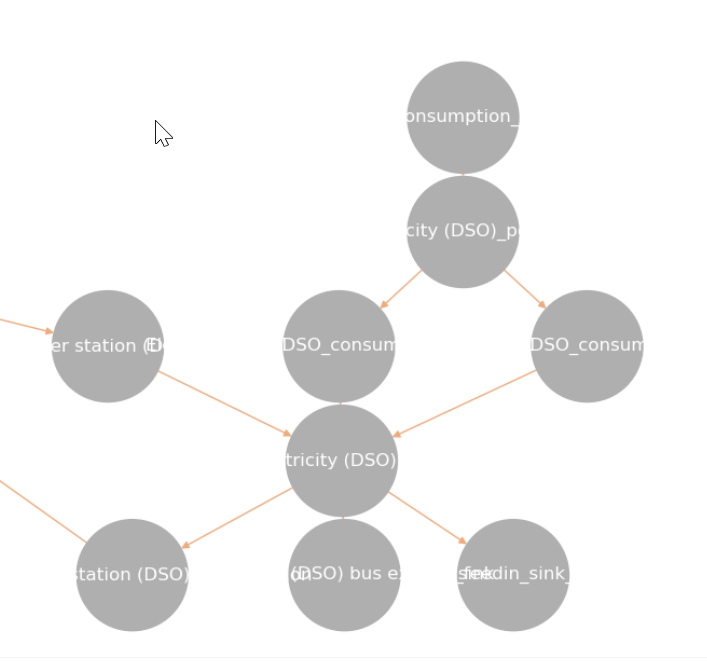
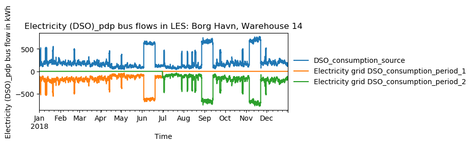

================================
Moddeling Assumptions of the MVS
================================

Component models
----------------

The component models of the MVS result from the used python-library `oemof-solph` for energy modeling.

It requires component models to be simplified and linearized.
This is the reason that the MVS can provide a pre-feasibility study of a specific system setup,
but not the final sizing and system design.
The types of assets are presented below.

Non-dispatchable sources of generation
######################################

`Examples`:

    - PV plant
    - Wind plant

Dispatchable sources of generation
##################################

`Examples`:

    - Fuel sources
    - Run-of-the-river hydro power plant
    - Deep-ground geothermal plant (ground assumed to allow unlimited extraction of heat, not depending on season)

Fuel sources are added as dispatchable sources, which still can have development, investment, operational and dispatch costs.
They are added by adding a column in `energyProviders.CSV`, and setting file_name to `None`.

DSOs, eventhough also dispatchable sources of generation, should be added via `energyProviders.csv`,
as there are some additional features available then.

Both DSOs and the additional fuel sources are limited to following options:
- Electricity
- Heat
- H2
- Diesel
- Gas

This is as the default weighting factors to translate the energy carrier into electricity equivalent need to be defined. This definition is currently hard-coded in `constants.py` with `DEFAULT_WEIGHTS_ENERGY_CARRIERS`. With new energy carriers necessary, the list can easily be extended. Please see below for more information.

Dispatchable conversion assets
##############################

`Examples`:

    - Diesel generator
    - Electric transformers (rectifiers, inverters)

Energy excess
#############

An energy excess sink is placed on each of the LES energy busses, and therefore energy excess is allowed to take place on each bus of the LES.
This means that there are assumed to be sufficient vents (heat) or transistors (electricity) to dump excess (waste) generation.
Excess generation can only take place when a non-dispatchable source is present or if an asset can supply energy without any fuel or dispatch costs.

In case of excessive excess energy, a warning is given that it seems to be cheaper to have high excess generation than investing into more capacities.
High excess energy can for example result into an optimized inverter capacity that is smaller than the peak generation of installed PV.
This becomes unrealistic when the excess is very high.

Energy providers (DSOs)
-----------------------

The energy providers are the most complex assets in the MVS model. They are composed of a number of sub-assets

    - Energy consumption source, providing the energy required from the system with a certain price
    - Energy peak demand pricing "transformers", which represent the costs induced due to peak demand
    - Bus connecting energy consumption source and energy peak demand pricing transformers
    - Energy feed-in sink, able to take in generation that is provided to the DSO for revenue
    - Optionally: Transformer Station connecting the DSO bus to the energy bus of the LES

With all these components, the DSO can be vizualized as follows:



Variable energy consumption prices (timeseries)
###############################################

- Link to howto

Peak demand pricing
###################

A peak demand pricing scheme is based on an electricity tariff,
that requires the consumer not only to pay for the aggregated energy consumption in a time period (eg. kWh electricity),
but also for the maximum peak demand (load, eg. kW power) towards the DSO grid within a specific pricing period.

In the MVS, this information is gathered for the `energyProviders` with:

    - :const:`mvs_eland.utils.constants_json_strings.PEAK_DEMAND_PRICING_PERIOD` as the period used in peak demand pricing. Possible is 1 (yearly), 2 (half-yearly), 3 (each trimester), 4 (quaterly), 6 (every 2 months) and 12 (each month). If you have a `simulation_duration` < 365 days, the periods will still be set up assuming a year! This means, that if you are simulating 14 days, you will never be able to have more than one peak demand pricing period in place.

    - :const:`mvs_eland.utils.constants_json_strings.PEAK_DEMAND_PRICING` as the costs per peak load unit, eg. kW

To repesent the peak demand pricing, the MVS adds a "transformer" that is optimized with specific operation and maintainance costs per year equal to the PEAK_DEMAND_PRICING for each of the pricing periods.
For two peak demand pricing persiods, the resulting dispatch could look as following:



Constraints
-----------

Constraints are controlled with the file `constraints.csv`.

Minimal renewable share constraint
##################################

The minimal renewable share constraint requires the capacity and dispatch optimization of the MVS to reach at least the minimal renewable share defined within the constraint. The renewable share of the optimized energy system may also be higher then the minimal renewable share.

The minimal renewable share is applied to the minimal renewable share of the whole, sector-coupled energy system, but not specific sectors. As such, energy carrier weighting plays a role and may lead to unexpected results. The constraint reads as follows:

.. math:
        minimal renewable factor <= \frac{\sum renewable generation \cdot weighting factor}{\sum renewable generation \cdot weighting factor + \sum non-renewable generation \cdot weighting factor}


:Deactivating the constraint:

The minimal renewable share constraint is deactivated by defining following row in `constraints.csv` as follows:

```minimal_renewable_share,factor,0```

:Activating the constraint:

The constraint is enabled when the value of the minimal renewable share factor is above 0 in `constraints.csv`:

```minimal_renewable_share,factor,0.3```


Depending on the energy system, especially when working assets which are not to be capacity-optimized, it is possible that the minimal renewable share criterion can not be met. The simulation terminates in that case. If you are not sure if your energy system can meet the constraint, set all `optimize_Cap` to `True`, and then investigate further.
Also, if you are aiming at very high minimal renewable shares, the simulation time can increase drastically. If you do not get a result after a maximum of 20 Minutes, you should consider terminating the simulation and trying with a lower minimum renewable share.

The minimum renewable share is introduced to the energy system by `D2.constraint_minimal_renewable_share()` and a validation test is performed with `E4.minimal_renewable_share_test()`.

Weighting of energy carriers
----------------------------

To be able to calculate sector-wide key performance indicators, it is necessary to weight energy carriers depending on their usable potential. With the conference paper handed in to the CIRED workshop we propose a methodolgy comparable to Gasoline Gallon Equivalents. This definition is currently hard-coded in `constants.py` with `DEFAULT_WEIGHTS_ENERGY_CARRIERS`. New energy carriers should be atted to its list. Unknown carriers raise an `UnknownEnergyCarrier` Error.

Following conversion factors and energy carriers are defined:

.. list-table:: Weights of energy carriers
   :widths: 50 25 25 25
   :header-rows: 1

   * - Energy carrier
     - Energy carrier unit
     - Conversion factor unit
     - Value of conversion factor
   * - Electricity
     - kWh_el
     - kWh_eleq/kWh_el
     - 1
   * - Heat
     - kWh_therm
     - kWh_eleq/kWh_therm
     - 1
   * - H2
     - kg
     - kWh_eleq/kg
     - 32.87
   * - Diesel
     - l
     - kWh_eleq/l
     - 8.20
   * - Gas
     - l
     - kWh_eleq/l
     - 5.38

The confersion factors are derived from their `Gasoline Gallon Equivalents.<https://epact.energy.gov/fuel-conversion-factors>`_


Limitations
-----------

When running simulations with the MVS, there are certain peculiarities to be aware of. The peculiarities can be considered as limitations, some of which are merely assumptions and others are drawbacks of the model. Some of those are inherited due to the nature of the MVS and its underlying modules, and some can still be addressed in the future during the MVS development process, which is still ongoing. The following table lists the MVS limitations based on their type.

.. list-table:: Limitations
   :widths: 25 25 25
   :header-rows: 1

   * - Type
     - Limitation
     - Link
   * - Inherited
     - Disregard of some real life constraint
     - :ref:disregard-label
   * - Inherited
     - Simplified asset model
     - :ref:simplified-label
   * - Inherited
     - No degradation
     - :ref:degradation-label
   * - Inherited
     - Perfect foresight
     - :ref:perfectforesight-label
   * - Can be addressed
     - Extension of KPIs
     - :ref:kpi-label
   * - Can be addressed
     - Random excess energy distribution
     - :ref:random-label
   * - Can be addressed
     - Renewable energy share defintion
     - :ref:reshare-label
   * - Can be addressed
     - Energy carrier rating
     - :ref:carrier-label     
   * - Can be addressed
     - Energy shortage or grid interruption
     - :ref:shortage-label
   * - Can be addressed
     - Generic cost definitions
     -  :ref:generic-label
   * - Can be addressed
     - Unlinked transformers of one technical unit
     - :ref:unlinked    

.. _disregard-label:
Disregard of some real life constraint
######################################
:Limitation: 
The real life constraint of the dispatch of assets, that it is not possible to have two flows in opposite directions at the same time step, is not adhered to in the MVS.

:Reason: 
The MVS is based on the python library `oemof-solph`. Its generic components are used to set up the energy system. As a ground rule, the components of `oemof-solph` are uni-directional. This means that for an asset that is bi-directional (physically for an inverter and logically for consumption/feed-in from/to the grid), two transformer objects have to be used. 
To archieve that one flow has to be zero when the other is larger zero, one would have to implement following relation:

.. math:: 
        E_{in} \cdot E_{out} = 0

However, this relation creates a non-linear problem and can not be implemented in `oemof-solph`.

:Implications: 
This limitation means that the MVS might result in unfeasible dispatch of assets. For instance, a bus might be supplied by a rectifier and itself supplying an inverter at the same time step t, which cannot logically happen if these assets are part of one physical bi-directional inverter. Another case that could occur is feeding the grid and consuming from it at the same time t.

.. _simplified-label:
Simplified asset model
######################
:Limitation:
The MVS simplifies the component model of some assets.

    * Generators have an efficiency that is not load-dependent
    * Storage have a charging efficiency that is not SOC-dependent
    * Turbines are implemented without ramp rates

:Reason:
The MVS is based oemof-solph python library and uses its generic components to set up an energy system. Transformers and storages cannot have variable efficiencies.

:Implications:
Simplifying the implementation of some component specifications can be beneficial for the ease of the model, however, it contributes to the lack of realism and might result in less accurate values. The MVS accepts the decreased level of detail in return for a quick evaluation of its scenarios, which are often only used for a pre-feasibility analysis. 

.. _degradation-label:
No degradation
##############
:Limitation:
The MVS does not degrade the generation of a production asset over the lifetime of the project.

:Reason:
The simulation of the MVS is only based on a single reference year, and it is not possible to take into account multi-year degradation of asset efficiency. 

:Implications:
This results in an overestimation of the energy generated by the asset, which implies that the calculation of some other results might also be overestimated (e.g., overestimation of feed-in energy). The user can cicumvent this by applying the degradation factor to the generation time series before inputting it into the MVS.

.. _perfectforesight-label:
Perfect foresight
#################
:Limitation:
The optimal solution of the energy system is based on perfect foresight.

:Reason:
As the MVS and thus oemof-solph, which is handling the energy system model, know the generation and demand profiles for the whole simulation time and solve the optimization problem based on a linear equation system, the solver knows their dispatch for certain, whereas in reality the generation and demand could only be forecasted.

:Implications:
The perfect foresight can lead to suspicious dispatch of assets, for example charging of a battery right before a (in real-life) random blackout occurs. The systems optimized with the MVS therefore, represent their optimal potential, which in reality could not be reached. The MVS has thus a tendency to underestimate the needed battery capacity or the minimal state of charge for backup purposes, and also designs the PV system and backup power according to perfect forecasts. In reality, operational margins would need to be added.

.. _kpi-label:
Extension of KPIs
#################
:Limitation:
Some important KPIs, usually required by developers like the internal rate of return (IRR), payback period or return on equity (ROE), are currently not implemented in the MVS.

:Reason:
The MVS tool is a work in progress and this can still be addressed in the future.

:Implications:
The absence of such indicators might affect decision-making.

.. _random-label:
Random excess energy distribution
#################################
:Limitation:
There is random excess distribution between the feed-in sink and the excess sink when no feed-in-tariff is assumed in the system.

:Reason:
Since there is no feed-in-tariff to benefit from, the MVS randomly distributes the excess energy between the feed-in and excess sinks. As such, the distribution of excess energy changes when running several simulations for the same input files. 

:Implications:
On the first glance, the distribution of excess energy onto both feed-in sink and excess sink may seem off to the end-user. Other than these inconveniences, there are no real implications that affect the capacity and dispatch optimization. 
When a degree of self-supply and self-consumption is defined, the limitation might tarnish these results.

.. _reshare-label:
Renewable energy share defintion
################################
:Limitation:
The current renewable energy share depends on the share of renewable energy production assets directly feeding the load. The equation to calculate the share also includes the energy carrier rating as described here below:

.. math:: 
        RES = \frac{\sum_i E_{RE,generation}(i) \cdot w_i}{\sum_i E_{RE,generation}(i) \cdot w_i + \sum_k E_{nonRE,generation}(k) \cdot w_k}

i: renewable energy asset

k: non-renewable energy asser

:Reason:
The MVS tool is a work in progress and this can still be addressed in the future.

:Implications:
This might result in different values when comparing them to other models. Another way to calculate it is by considering the share of energy consumption supplied from renewable sources.

.. _carrier-label:
Energy carrier rating
#####################
:Limitation: 
The MVS assumes a usable potential/energy content rating for every energy carrier. The current version assumes that 1 kWh thermal is equivalent to 1 kWh electricity.

:Reason: 
This is an approach that the MVS currently uses.

:Implications:
By weighing the energy carriers according to their energy content (Gasoline Gallon Equivalent (GGE)), the MVS might result in values that can't be directly assessed. Those ratings affect the calaculation of the levelized cost of the energy carriers, but also the minimum renewable energy share constraint.

.. _shortage-label:
Energy shortage or grid interruption
####################################
:Limitation: 
The MVS assumes no shortage or grid interruption in the system.

:Reason: 

:Implications:
Electricity shortages due to power cuts might happen in real life. The MVS currently omits this scenario which might implicate unreasonable results. If a system is self-sufficient but relies on grid-connected PV systems, the latter stop feeding the load if any power cuts occur and the battery storage systems might not be enough to serve the load (energy shortage).

.. _generic-label:
Generic cost definitions
########################
:Limitation:
The MVS includes development costs, specific costs, O&M costs and disptach costs.

:Reason:
The MVS assumes those costs only for simplification.

:Implications:
This could lead to a rough estimation of the entire project costs.

.. _unlinked:
Unlinked transformers of one technical unit
###########################################
:Limitation:
Some components should be modelled as separate transformers in the MVS while in real life they are one technical unit.

:Reason:
The MVS uses oemof-solph's generic components listed here below:

    - Sink (one input, no output)
    - Source (one output, no input)
    - Linear Transformer (one input, n outputs)
    - Storage (one input, one output)

:Implications: 
Since one input is only allowed, such technical units are modelled as two separate transformers that are currently unlinked in the MVS (e.g., hybrid inverter, heat pump, distribution transformer, etc.). This raises a difficulty to define costs in the input data. It also results in two optimized capacities for one logical unit.

This limitation is to be addressed with a constraint which links both capacities of one logical unit, and therefore solves both the problem to attribute costs and the previously differing capacities.
