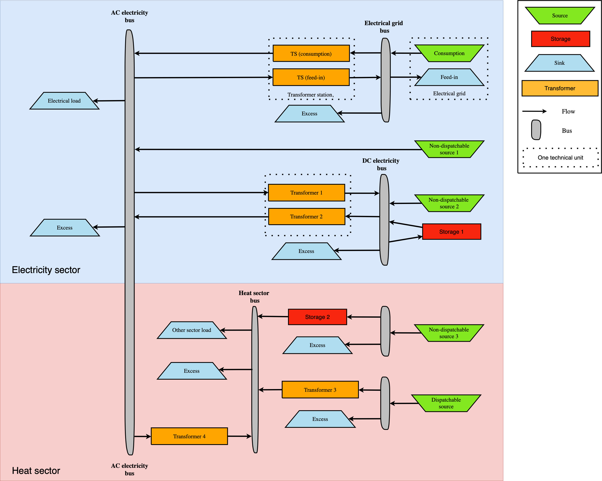

======================
Set of Model Equations
======================

Economic Dispatch
-----------------

Linear programming is a mathematical modelling and optimization technique for a system of a linear objective function subject to linear constraints. The goal of a linear programming problem is to find the optimal value for the objective function, be it a maximum or a minimum. The MVS is based on oemof-solph, which in turn uses Pyomo to create a linear problem. The economic dispatch problem in the MVS has the objective of minimizing the production cost by allocating the total demand among the generating units at each time step. The equation is the following:

.. math::
        min Z = \sum_i a_i \cdot CAP_i + \sum_i \sum_t c_{var,i} \cdot E_i(t)
.. math::        
        CAP_i \geq 0
.. math::        
        E_i(t) \geq 0  \qquad  \forall t
        
.. math::
        i \text{: asset}

        a_i \text{: asset annuity [currency/kWp/year, currency/kW/year, currency/kWh/year]}

        CAP_i \text{: asset capacity [kWp, kW, kWh]}

        c_{var,i} \text{: variable operational or dispatch cost [currency/kWh, currency/L]}

        E_i(t) \text{: asset dispatch [kWh]}

The annual cost function of each asset includes the capital expenditure (investment cost) and residual value, as well as the operating expenses of each asset. It is expressed as follows:

.. math:: 
        a_i = \left( capex_i + \sum_{k=1}^{n} \frac{capex_i}{(1+d)^{k \cdot t_a}} - c_{res,i} \right) \cdot CRF(T) + opex_i
.. math:: 
        CRF(T) = \frac{d \cdot (1+d)^T}{(1+d)^t - 1}
        
.. math::
        capex_i \text{: specific investment costs [currency/unit]}

        n \text{: number of replacements of an asset within project lifetime T}

        t_a \text{: asset lifetime [years]}

        CRF \text{: capital recovery factor}

        c_{res,i} \text{: residual value of asset i at the end of project lifetime T [currency/unit]}

        opex_i \text{: annual operational and management costs [currency/unit/year]}

        d \text{: discount factor}

        T \text{: project lifetime [years]}

The CRF is a ratio used to calculate the present value of the the annuity. The discount factor can be replaced by the weighted average cost of capital (WACC), calculated by the user. The lifetime of the asset t_a and the lifetime of the project T can be different from each other; hence, the number of replacements n is estimated using the equation below:

.. math::
        n = round \left( \frac{T}{t_a} + 0.5 \right) - 1
        
The residual value is also known as salvage value and it represents an estimate of the monetary value of an asset at the end of the project lifetime T. The MVS considers a linear depreciation over T and accounts for the time value of money by using the following equation:

.. math::
        c_{res,i} = \frac{capex_i}{(1+d)^{n \cdot t_a}} \cdot \frac{1}{T} \cdot \frac{(n+1) \cdot t_a - T}{(1+d)^T}

Energy Balance Equation
-----------------------

One main constraint that the optimization model is subject to is the energy balance equation. The latter maintains equality between the incoming energy into a bus and the outgoing energy from that bus. This balancing equation is applicable to all bus types, be it electrical, thermal, hydrogen or for any other energy carrier.

.. math::
        \sum E_{in,i}(t) - \sum E_{out,j}(t) = 0

E_{in,i}: energy flowing from asset i to the bus

E_{out,j}: energy flowing from the bus to asset j

It is very important to note that assets i and j can be the same asset (e.g., battery) however, one of the energy flowing values E_{in} or E_{out} should be zero at the same time step t.

Example: Sector Coupled Energy System Scenario
----------------------------------------------

In order to understand the component models, a generic sector coupled example in shown in the next figure. It brings together the electricity and heat sector through Transformer 4 as it connects the two sector buses. 

 
 For the sake of simplicity, the following table gives an example for each asset type with an abbreviation to be used in the energy balance and component equations.
 
 .. list-table:: Asset Types and Examples
   :widths: 50 25 25 25
   :header-rows: 1

   * - Asset Type
     - Asset Example
     - Abbreviation
     - Unit
   * - Non-dispatchable source 1
     - Wind turbine
     - wind
     - kW
   * - Non-dispatchable source 2
     - Photovoltaic panels
     - PV
     - kWp
   * - Storage 1
     - Battery energy storage
     - bat
     - kWh
   * - Transformer 1
     - Rectifier
     - rec
     - kW
   * - Transformer 2
     - Solar inverter
     - inv
     - kW
   * - Non-dispatchable source 3
     - Solar thermal collector
     - stc
     - kWth
   * - Storage 2
     - Thermal energy storage
     - tes
     - kWth
   * - Dispatchable source
     - Heat source (e.g., biogas)
     - heat
     - L
   * - Transformer 3
     - Turbine
     - turb
     - kWth
   * - Transformer 4
     - Heat pump
     - hp
     - kWth

