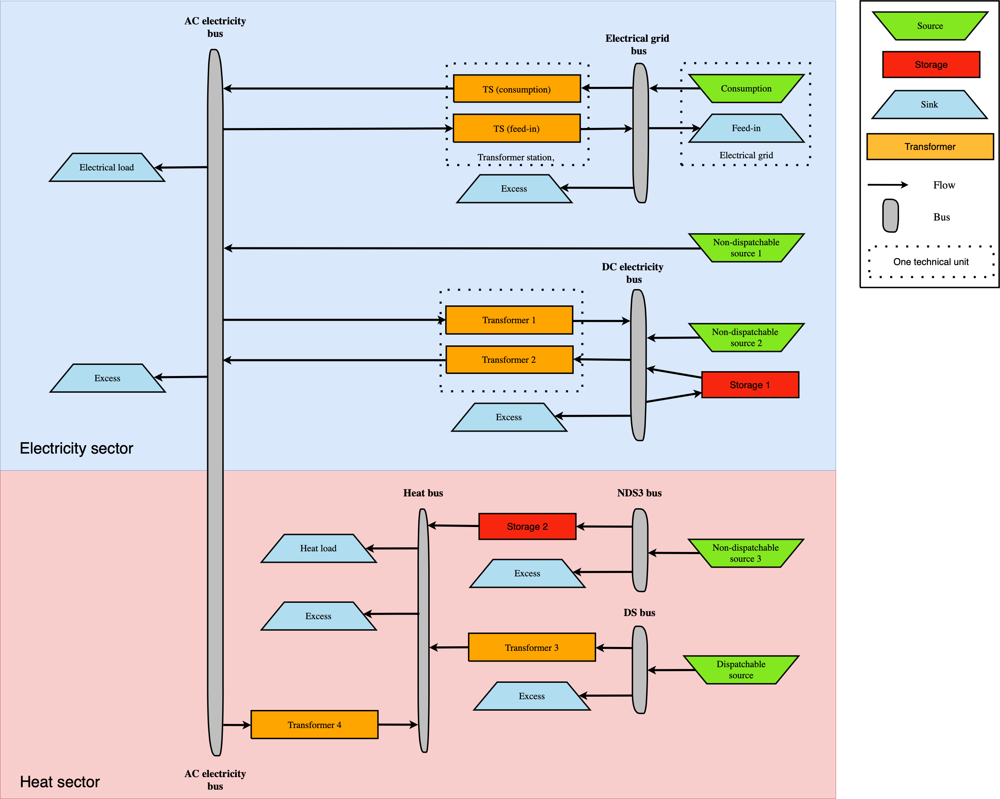

======================
Set of Model Equations
======================

The MVS is based on the programming framework `oemof-solph` and builds an energy system model based up on its nomenclature.
As such, the energy system model can be described with a linear equation system.
Below, the most important aspects are described in a genrealized way, as well as explained based on an example.
This will ease the comparision to other energy system models.

Economic Dispatch
-----------------

Linear programming is a mathematical modelling and optimization technique for a system of a linear objective function subject to linear constraints.
The goal of a linear programming problem is to find the optimal value for the objective function, be it a maximum or a minimum.
The MVS is based on `oemof-solph`, which in turn uses `Pyomo` to create a linear problem.
The economic dispatch problem in the MVS has the objective of minimizing the production cost by allocating the total demand among the generating units at each time step.
The equation is the following:

.. math::
        min Z = \sum_i a_i \cdot CAP_i + \sum_i \sum_t c_{var,i} \cdot E_i(t)

.. math::
        CAP_i &\geq 0

        E_i(t) &\geq 0  \qquad  \forall t

        i &\text{: asset}

        a_i &\text{: asset annuity [currency/kWp/year, currency/kW/year, currency/kWh/year]}

        CAP_i &\text{: asset capacity [kWp, kW, kWh]}

        c_{var,i} &\text{: variable operational or dispatch cost [currency/kWh, currency/L]}

        E_i(t) &\text{: asset dispatch [kWh]}

The annual cost function of each asset includes the capital expenditure (investment cost) and residual value, as well as the operating expenses of each asset.
It is expressed as follows:

.. math:: 
        a_i &= \left( capex_i + \sum_{k=1}^{n} \frac{capex_i}{(1+d)^{k \cdot t_a}} - c_{res,i} \right) \cdot CRF(T) + opex_i

        CRF(T) &= \frac{d \cdot (1+d)^T}{(1+d)^t - 1}

.. math::
        capex_i &\text{: specific investment costs [currency/unit]}

        n &\text{: number of replacements of an asset within project lifetime T}

        t_a &\text{: asset lifetime [years]}

        CRF &\text{: capital recovery factor}

        c_{res,i} &\text{: residual value of asset i at the end of project lifetime T [currency/unit]}

        opex_i &\text{: annual operational and management costs [currency/unit/year]}

        d &\text{: discount factor}

        T &\text{: project lifetime [years]}

The CRF is a ratio used to calculate the present value of the the annuity.
The discount factor can be replaced by the weighted average cost of capital (WACC), calculated by the user.

The lifetime of the asset :math:`t_a` and the lifetime of the project :math:`T` can be different from each other;
hence, the number of replacements n is estimated using the equation below:

.. math::
        n = round \left( \frac{T}{t_a} + 0.5 \right) - 1
        
The residual value is also known as salvage value and it represents an estimate of the monetary value of an asset at the end of the project lifetime T.
The MVS considers a linear depreciation over T and accounts for the time value of money by using the following equation:

.. math::
        c_{res,i} = \frac{capex_i}{(1+d)^{n \cdot t_a}} \cdot \frac{1}{T} \cdot \frac{(n+1) \cdot t_a - T}{(1+d)^T}

Energy Balance Equation
-----------------------

One main constraint that the optimization model is subject to is the energy balance equation.
The latter maintains equality between the incoming energy into a bus and the outgoing energy from that bus.
This balancing equation is applicable to all bus types, be it electrical, thermal, hydrogen or for any other energy carrier.

.. math::
        \sum E_{in,i}(t) - \sum E_{out,j}(t) = 0 \qquad  \forall t

.. math::
        E_{in,i} &\text{: energy flowing from asset i to the bus}

        E_{out,j} &\text{: energy flowing from the bus to asset j}

It is very important to note that assets i and j can be the same asset (e.g., battery).
`oemof-solph` allows both :math:`E_{in}` or :math:`E_{out}` to be larger zero in same time step t (see :ref:`_limitations-real-life-constraint`).

Example: Sector Coupled Energy System
-------------------------------------

In order to understand the component models, a generic sector coupled example in shown in the next figure.
It brings together the electricity and heat sector through Transformer 4 as it connects the two sector buses.

 
For the sake of simplicity, the following table gives an example for each asset type with an abbreviation to be used in the energy balance and component equations.
 
 .. list-table:: Asset Types and Examples
   :widths: 50 25 25 25
   :header-rows: 1

   * - Asset Type
     - Asset Example
     - Abbreviation
     - Unit
   * - Non-dispatchable source 1
     - Wind turbine
     - wind
     - kW
   * - Non-dispatchable source 2
     - Photovoltaic panels
     - pv
     - kWp
   * - Storage 1
     - Battery energy storage
     - bat
     - kWh
   * - Transformer 1
     - Rectifier
     - rec
     - kW
   * - Transformer 2
     - Solar inverter
     - inv
     - kW
   * - Non-dispatchable source 3
     - Solar thermal collector
     - stc
     - kWth
   * - Storage 2
     - Thermal energy storage
     - tes
     - kWth
   * - Dispatchable source
     - Heat source (e.g., biogas)
     - heat
     - L
   * - Transformer 3
     - Turbine
     - turb
     - kWth
   * - Transformer 4
     - Heat pump
     - hp
     - kWth

All grids and dispatchable sources are assumed to be available 100% of the time with no consumption limits.
The MVS includes a sink component for excess energy, connected to each bus in the system and denoted by :math:`E_{ex}` in the equations.
This excess sink accounts for the extra energy in the system that has to be dumped.

Electricity Grid Equation
#########################

The electricity grid is modeled though a feedin and a consumption node.
Transformers limit the peak flow into or from the local electricity line.
Electricity sold to the grid experiences losses in the transformer :math:`(ts,f)`.

.. math::
        E_{grid,c}(t) - E_{grid,f}(t) + E_{ts,f}(t) \cdot \eta_{ts,f} - E_{ts,c}(t) = 0 \qquad  \forall t
        
.. math::
        E_{grid,c} &\text{: energy consumption from the electricity grid}
        
        E_{grid,f} &\text{: energy feed into the electricity grid}
        
        E_{grid,c} &\text{: transformer station feed-in}
        
        \eta_{ts,f} &\text{: transformer station efficiency}
        
        E_{grid,c} &\text{: transformer station consumption}
 
Non-Dispatchable Source Equations
#################################

Non-dispatchable sources in our example are a wind, pv and solar thermal plant.
Their generation is determined by the provided timeseries of instantaneous generation, providing :math:`\alpha`, :math:`\beta`, :math:`\gamma`.

.. math::   
        E_{wind}(t) &= CAP_{wind} \cdot \alpha_{wind}(t) \qquad  \forall t
        
        E_{pv}(t) &= CAP_{pv} \cdot \beta_{pv}(t) \qquad  \forall t
        
        E_{stc}(t) &= CAP_{stc} \cdot \gamma{stc}(t) \qquad  \forall t

.. math::
        E_{wind} &\text{: energy generated from the wind turbine}
        
        CAP_{wind} &\text{: wind turbine capacity [kW]}

        \alpha_{wind} &\text{: instantaneous wind turbine performance metric [kWh/kW]}
        
        E_{pv} &\text{: energy generated from the PV panels}
        
        CAP_{pv} &\text{: PV panel capacity [kWp]}

        \beta_{pv} &\text{: instantaneous PV specific yield [kWh/kWp]}
        
        E_{stc} &\text{: energy generated from the solar thermal collector}
        
        CAP_{stc} &\text{: Solar thermal collector capacity [kWth]}

        \gamma_{stc} &\text{: instantaneous collector's production [kWh/kWth]}
        
Storage Model
#############

There are two storages in our system: An electricity storage (Storage 1, :math:`bat`) and a heat storage (Storage 2, :math:`tes`).
Below, the equations for the Storage 1 are provided, but Storage 2 follows analogous equations for charge, discharge and bounds.

.. math::   
        E_{bat}(t) = E_{bat}(t - 1) + E_{bat,in}(t) \cdot \eta_{bat,in} - \frac{E_{bat,out}}{\eta_{bat,out}} - E_{bat}(t - 1) \cdot \epsilon \qquad  \forall t

.. math::
        CAP_{bat} \cdot SOC_{min} \leq E_{bat}(t) \leq CAP_{bat} \cdot SOC_{max} \qquad  \forall t
        
        0 \leq E_{bat}(t) - E_{bat}(t - 1) \leq CAP_{bat} \cdot C_{rate,in} \qquad  \forall t
        
        0 \leq E_{bat}(t - 1) - E_{bat}(t) \leq CAP_{bat} \cdot C_{rate,out} \qquad  \forall t

.. math::
        E_{bat} &\text{: energy stored in the battery at time t}
        
        E_{bat,in} &\text{: battery charging energy}
        
        \eta_{bat,in} &\text{: battery charging efficiency}
        
        E_{bat,out} &\text{: battery discharging energy}
        
        \eta_{bat,out} &\text{: battery discharging efficiency}
        
        \epsilon &\text{: decay per time step}
        
        CAP_{bat} &\text{: battery capacity [kWh]}
        
        SOC_{min} &\text{: minimum state of charge}
        
        SOC_{max} &\text{: maximum state of charge}
        
        C_{rate,in} &\text{: battery charging rate}
        
        C_{rate,in} &\text{: battery discharging rate}
 
DC Electricity Bus Equation
###########################

.. math::   
        E_{pv}(t) + E_{bat,out}(t) \cdot \eta_{bat,out} + E_{rec}(t) \cdot \eta_{rec} - E_{inv}(t) - E_{bat,in} - E_{ex}(t) = 0 \qquad  \forall t

.. math::
        E_{rec} &\text{: rectifier energy}
        
        \eta_{rec} &\text{: rectifier efficiency}
        
        E_{inv} &\text{: inverter energy}

AC Electricity Bus Equation
###########################

This describes the local electricity grid and all connected assets:

.. math::
        E_{ts,c}(t) \cdot \eta_{ts,c} + E_{wind}(t) + E_{inv}(t) \cdot \eta_{inv} - E_{ts,c}(t) - E_{rec}(t) - E_{hp}(t) - E_{el}(t) - E_{ex}(t) = 0 \qquad  \forall t
        
.. math::
        \eta_{ts,c} &\text{: transformer station efficiency}
        
        \eta_{inv} &\text{: inverter efficiency}
        
        E_{hp} &\text{: heat pump electrical consumption}
        
        E_{el} &\text{: electrical load}

Heat Bus Equation
#################

This describes the heat bus and all connected assets:

.. math::
        E_{tes}(t) \cdot \eta_{tes} + E_{turb}(t) \cdot \eta_{turb} + E_{hp}(t) \cdot COP - E_{th}(t) - E_{ex}(t) = 0

.. math::
        \eta_{tes} &\text{: thermal storage efficiency}

        \eta_{turb} &\text{: turbine efficiency}

        COP &\text{: heat pump coefficient of performance}

        E_{th} &\text{: heat load}

NDS3 Bus Equation
#################

The NDS3 Bus is an example of a bus, which does not serve both as in- and output of a storage system.

.. math::
        E_{stc}(t) - E_{tes}(t) - E_{ex}(t) = 0

.. math::
        E_{tes} \text{: thermal energy storage}

DS Bus Equation
###############

The DS Bus shows an example of a fuel source providing an energy carrier (biogas) to a transformer (turbine).

.. math::
        E_{heat}(t) - E_{turb}(t) - E_{ex}(t) = 0

.. math::
        E_{heat} &\text{: thermal energy (biogas) production}
        
        E_{turb} &\text{: turbine (biogas turbine) energy}

