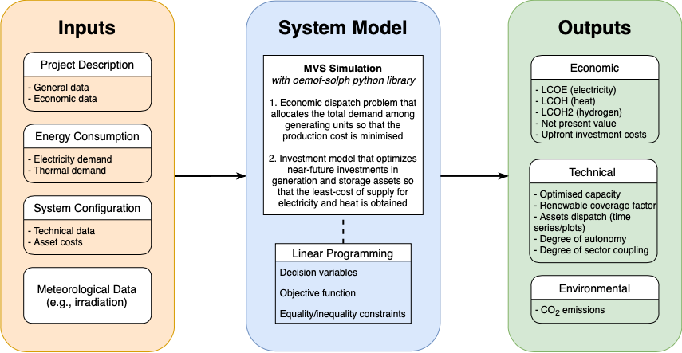

=================
About the Project
=================

H2020 Project E-Land
--------------------

License
-------

The MVS is licensed with the **GNU General Public License v2.0**. The GNU GPL is the most widely used free software license and has a strong copyleft requirement. When distributing derived works, the source code of the work must be made available under the same license. There are multiple variants of the GNU GPL, each with different requirements.

Flowchart
-------
 
The MVS' global flowchart, or graphical model, is divided into three connected blocks that trace the logic sequence: inputs, system model, and outputs. This is a typical representation of a simulation model.

The user is asked to enter the required data through a web interface. In developer mode, the data is submitted as a number of csv files. This input data is split into  four categories:

1.	Project description, which entails the general information regarding the project (country, coordinates, etc.), as well as the economic data such as the discount factor, project duration, or tax;

2.	Energy consumption, which is expressed as times series based on the type of energy (in this case: electrical and therma);

3.	System configuration, in which the user specifies the technical and financial data of each asset; and

4.	Meteorological data, which is related to the components that generate electricity by harnessing an existing source of energy that is weather- and time-dependent (e.g., solar and wind power).

This set of input data is then translated to a linear programming problem, also known as a constrained optimization problem. The MVS is based on the oemof-solph python library that describes the problem by specifying the objective function, the decision variables and the bounds and constraints. The goal is to (1) minimize the production costs by determining the generating units' optimal output, which meets the total demand, and (2) otpimize near-future investments in generation and storage assets with the least possible cost of energy.
The simulation outputs are also separated into categories. The economic results, such as the levelized cost of electricity or heat or the net present value of the projected investments, are the ones used for financial evaluation and decision making. The technical results also showcase several important values, such as the optimized capacities and dispatch of each asset. Lastly, the system’s environmental contribution is shown through the value of CO2 emissions.

MVS Validation Plan
-------

The adopted validation plan is part of the MVS’ entire development process and is based on three main validation types: conceptual model validation, model verification and operational validity. Following some in-depth research, a validation approach is chosen for the MVS, through which the most appropriate validation techniques are applied to the MVS so that it gains the necessary credibility.

*Conceptual model validation* consists of looking into the underlying theories and assumptions. Therefore, the conceptual validation scheme includes a comprehensive review of the generated equations by the oemof python library and the components’ models. Next step is to try and adapt them to one pilot project with specific constraints. Tracing and examining the flowchart is also considered as part of this validation type. The aim is to assess the reasonability of the model behavior through pre-requisite knowledge. 

*Model verification* is related to computer programming and looks into whether the code is a correct representation of the conceptual model. To accomplish that, integration tests for each module will be written to assert that the output is as expected. The simulation will also be run several times for the same input data to double check the results. 

*Operational validity* determines if the model’s output is within the required accuracy. In order to achieve that, several validation techniques are used, namely:

*	Benchmark testing, through which scenarios are created with different constraints and component combinations, and the output is calculated and compared to the expected one;
  
*	Extreme scenarios (e.g., drastic meteorological conditions), created to make sure the simulation is through, then evaluate the output behavior by the use of graphs and qualitative analysis;
  
*	Replication of one pilot project, with a validated optimization model with different component representation to compare and assess the results; and
  
*	Sensitivity analysis, through which input-output transformations are studied to show the impact of changing the values of some input parameters.
=======

