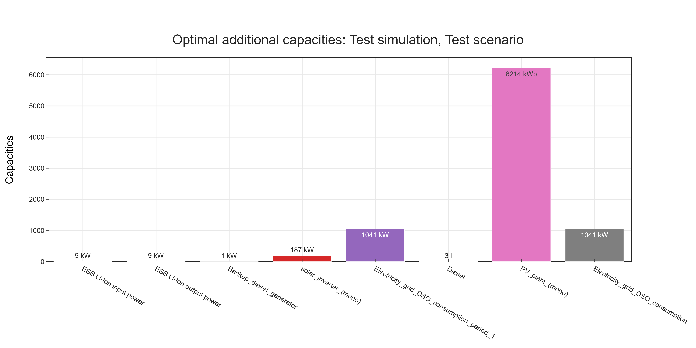
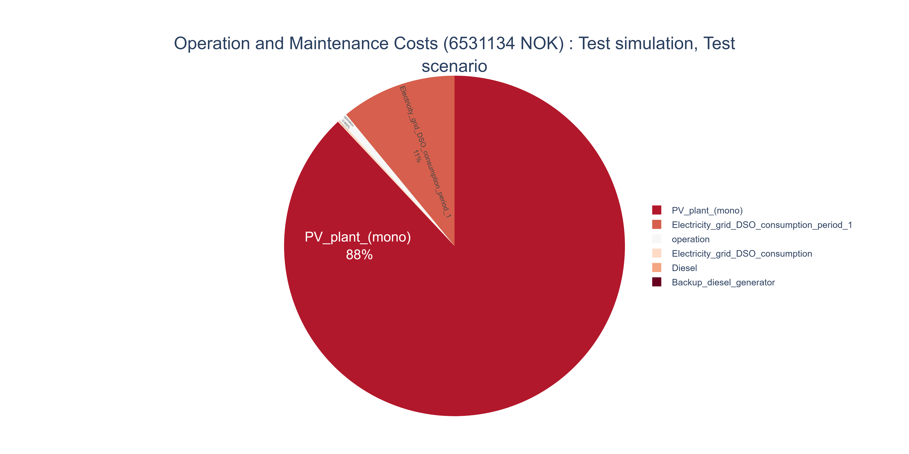
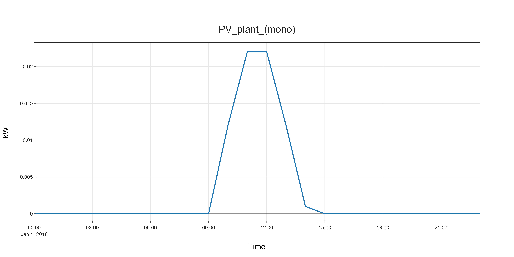
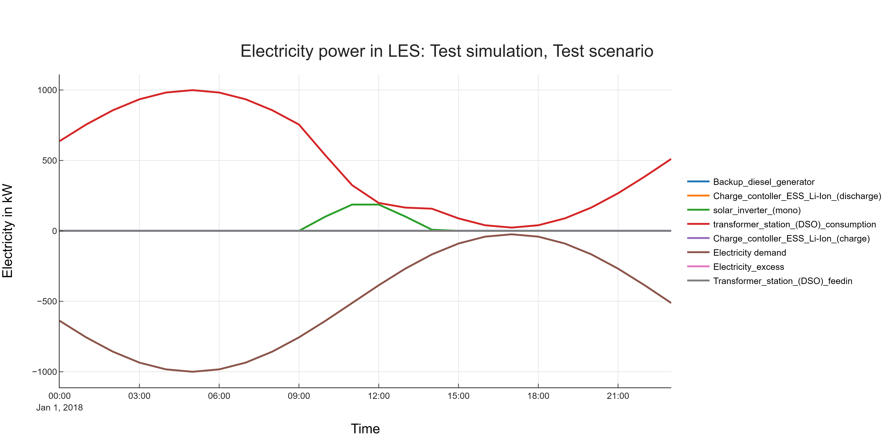
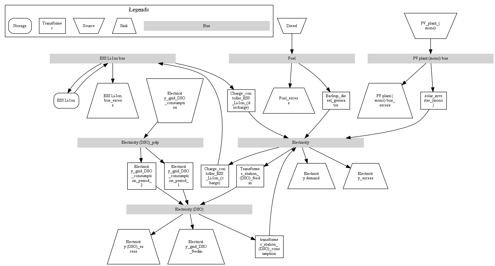
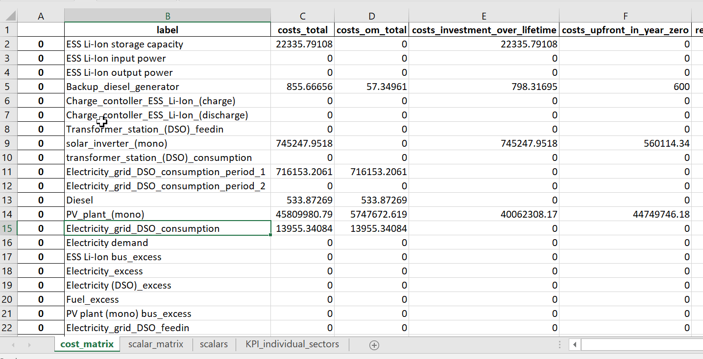
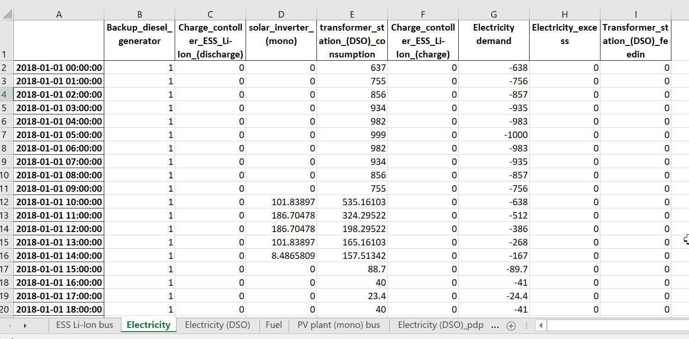
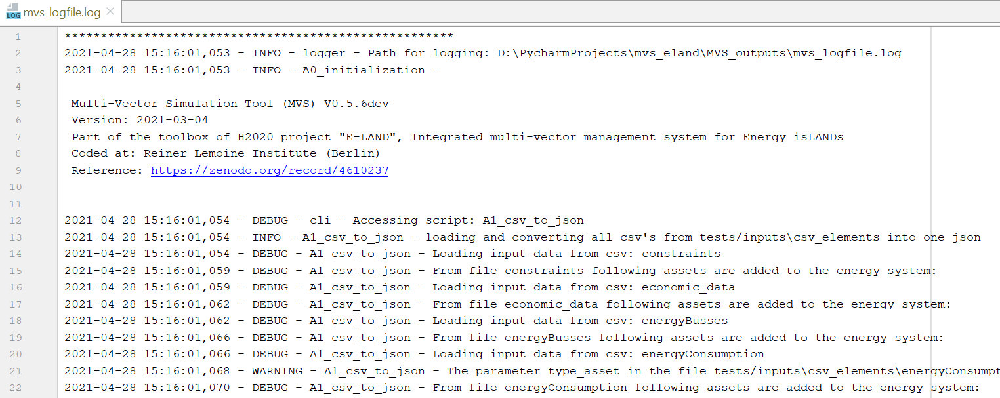

.. _simulation_outputs:

=======================
Outputs of a simulation
=======================

After optimization of an energy system, the MVS evaluates the simulation output. It evaluates the flows, costs and performance of the system. As a result, it calculates a number of :ref:`key performance indicators (KPI) <key_performance_indicators_overview>`, namely :ref:`economic <kpi_economic>`, :ref:`technical <kpi_technical>` and :ref:`environmental <kpi_environmental>` KPI. Depending on the simulation settings, it can also generate different :ref:`figures <output_figures>` of the results and an :ref:`automatic report <automatic_report>` in :code:`pdf` or :code:`html` format.

.. _key_performance_indicators_overview:

Overview of Key Performance Indicators
######################################

.. Bullet list of all the KPI of the different KPI categories:

.. include:: outputs/MVS_kpi_categories.inc

.. the .inc files describing the kpis are automatically generated in `conf.py` from the `MVS_kpis_list.csv` file

In the sections :ref:`economic <kpi_economic>`, :ref:`technical <kpi_technical>` and :ref:`environmental <kpi_environmental>` KPI, these indicators are further defined and in :ref:`Files <output_files>` the possible exportable figures and files are presented. This takes place with the following structure:

:Definition: Definition of the defined KPI, can be used as tooltips.

:Type:  One of Numeric, Figure, Excel File, JSON, Time series, Logfile or html/pdf

:Unit: Unit of the KPI, multiple units possible if KPI can be applied to individual sectors (see also: :ref:`kpi_suffixes`).

:Valid Interval: Expected valid range of the KPI. Exceptions are possible under certain conditions.

:Related indicators: List of indicators that are related to the described KPI, either because they are part of its calculation or can be compared to it.

Besides these parameters attributes, the underlying equation of a specific KPI may be presented and explained, or further hints might be provided for the parameter evaluation or for special cases.

.. _kpi_suffixes:

Suffixes of KPI
###############

The KPI of the MVS can be calculated per asset, for each sector or for the overall system.

KPI calculated per asset are not included in the scalar results of the automatic report or in the stored Excel file, but are displayed separately. They do not need suffixes, as they are always displayed in tables next to the respective asset.

KPI calculated for each vector are specifically these KPI that aggregate the dispatch and costs of multiple assets. For cost-related KPI, such aggregating KPI have the energy vector they are describing as a suffix. An example would be the :code:`attributed_costs` of each energy vector - the attributed costs of the electricity and H2 sector would be called :code:`attributed_costs_electricity` and :code:`attributed_costs_H2` respectively.
For technical KPI, this suffix also applies, but additionally, due to the :ref:`energy carrier weighting <energy_carrier_weighting>`, they also feature the suffix :code:`electricity equivalent` when the weighting has been applied. The energy demand of the system is an example: the demand per sector would be :code:`total_demand_electricity` and :code:`total_demand_H2`. To be able to aggregate these cost into an overall KPI for the system, the electricity equivalents of both values are calculated. They then are named :code:`total_demand_electricity_electricity_equivalent` and :code:`total_demand_H2_electricity_equivalent`.

KPI that describe the costs of the overall energy system do not have suffixes. Technical KPI often have the suffix :code:`electricity_equivalent` to underline the energy carrier that the parameter is relative to.

.. _kpi_economic:

Economic KPI
############

All the KPI related to costs described below are provided in net present value.

.. include:: outputs/costs_total.inc

The Net present costs (NPC) is the present value of all the costs associated with installation, operation, maintenance and replacement of energy assets within the optimized multi-vector energy system over the whole project lifetime, deducting the present value of the residual values of asset at project and as well as all the revenues that it earns over the project lifetime. The capital recovery factor (CRF) is used to calculate the present value of the cash flows.

.. math::
    NPC = \sum_i{(c_specific + c_replacement + c_residual) \cdot CAP_i} + \sum_i{\sum_t{E_i(t)} \cdot p_dispatch}

.. include:: outputs/costs_cost_om.inc

.. include:: outputs/costs_om_total.inc

.. include:: outputs/costs_dispatch.inc

.. include:: outputs/costs_investment_over_lifetime.inc

.. include:: outputs/costs_upfront_in_year_zero.inc

.. include:: outputs/replacement_costs_during_project_lifetime.inc

.. include:: outputs/attributed_costs.inc

A multi-vector energy system connects energy vectors into a joined energy system and the system is then designed to have an optimial, joined operation. With other systems, the costs associated to each individual energy vector would be used to calculate the costs to supply the individual sector. With the multi-vector system, this could lead to distorted costs - for example if there is a lot of PV (electricity sector), which in the end is only supplying an electrolyzer (H2 sector). The investment and operational costs of the electricity sector assets would thus turn out to be very high, which could be considered unfair as the electricity from PV is solely used to provide the H2 demand.
Therefore, we define the :ref:`attributed costs of each energy vector <attributed_costs>`, to determine how much of the overall system costs should be attributed to one sector, depending on the energy demand it has compared to the other sectors. To be able to compare the demands of different energy carriers, :ref:`energy carrier weighting <energy_carrier_weighting>` is applied.

.. include:: outputs/annuity_total.inc

.. include:: outputs/annuity_om.inc

.. include:: outputs/levelized_costs_of_electricity_equivalent.inc

Specific electricity supply costs, eg. levelized costs of electricity are commonly used to compare the supply costs of different investment decisions or also energy provider prices to local generation costs. However, the a multi-vector energy system connects energy vectors into a joined energy system and the optimization objective of the MVS then is to minimize the overall energy costs, without distinguising between the different sectors. This sector-coupled energy system is then designed to have an optimial, joined operation. With other systems, the costs associated to each individual energy vector would be used to calculate the levelized costs of energy (LCOEnergy). With the multi-vector system, this could lead to distorted costs - for example if there is a lot of PV (electricity sector), which in the end is only supplying an electrolyzer (H2 sector). The LCOE of electricity would thus turn out to be very high, which could be considered unfair as the electricity from PV is solely used to provide the H2 demand.
Therefore, we define the :ref:`attributed costs of each energy vector <attributed_costs>`, to determine how much of the overall system costs should be attributed to one sector, depending on the energy demand it has compared to the other sectors. To be able to compare the demands of different energy carriers, :ref:`energy carrier weighting <energy_carrier_weighting>` is applied.

Therefore the levelized costs of energy (LCOEnergy) for energy carrier :math:`i` are defined based on the annuity of the attributed costs, the CRF and the demand of one energy sector :math:`E_{dem,i}`:

.. math::
        LCOEnergy_i = \frac{Attributed~costs \cdot CRF}{\sum_{t} E_{dem,i}(t)}

The LCOEnergy are are calculated for each sector (resulting in the levelized costs of electricity, heat, H2...), but also for the overall energy system. For the overall energy system, the levelized costs of electricity equivalent are calculated, as this system may supply different energy vectors.

.. include:: outputs/levelized_cost_of_energy_of_asset.inc

This KPI measures the cost of generating 1 kWh for each asset in the system.
It can be used to assess and compare the available alternative methods of energy production.
The levelized cost of energy of an asset (:math:`LCOE~ASSET_i`) is usually obtained
by looking at the lifetime costs of building and operating the asset per unit of total energy throughput of an asset over the assumed lifetime [currency/kWh].

Since not all assets are production assets, the MVS distinguishes between the type of assets.
For assets in energyConversion and energyProduction the MVS calculates the :math:`LCOE~ASSET_i`
by dividing the total annuity :math:`a_i` of the asset :math:`i` by the total flow :math:`\sum_{t} E_i(t)`.

.. math::
        LCOE~ASSET_i = \frac{a_i}{\sum_{t} E_i(t)}
  
For assets in :code:`energyStorage`, the MVS sums the annuity for :code:`storage capacity` :math:`a_{i,sc}`, :code:`input power` :math:`a_{i,ip}` and :code:`output power` :math:`a_{i,op}` and divides it by the :code:`output power` total flow :math:`\sum{t} E_{i,op}(t)`.

.. math::
        LCOE~ASSET_i = \frac{a_{i,sc} + a_{i,ip} + a_{i,op}}{\sum_{t}{E_{i,op}(t)}}

If the total flow is 0 in any of the previous cases, then the :math:`LCOE~ASSET` is set to :code:`None`.

.. math::
        LCOE~ASSET_i = None
  
For assets in :ref:`energyConsumption <consumption>`, the MVS outputs 0 for the :math:`LCOE~ASSET_i`.

.. math::
        LCOE~ASSET_i = 0

.. _kpi_technical:

Technical KPI
#############

.. include:: outputs/optimizedAddCap.inc

.. include:: outputs/flow.inc

.. include:: outputs/peak_flow.inc

.. include:: outputs/average_flow.inc

.. include:: outputs/annual_total_flow.inc

.. include:: outputs/total_demand.inc

.. include:: outputs/total_feedin.inc

.. include:: outputs/total_consumption_from_energy_provider.inc

.. include:: outputs/total_internal_non-renewable_generation.inc

.. include:: outputs/total_internal_renewable_generation.inc

.. include:: outputs/total_internal_generation.inc

.. include:: outputs/total_excess.inc

.. include:: outputs/total_renewable_energy_use.inc

.. include:: outputs/total_non-renewable_energy_use.inc

.. include:: outputs/renewable_share_of_local_generation.inc

The renewable share of local generation describes how much of the energy generated locally is produced from renewable sources.
It does not take into account the consumption from energy providers.

The renewable share of local generation for each sector does not utilize energy carrier weighting but has a limited, single-vector view:

.. math::
        REGen_v &=\frac{\sum_i {E_{rgen,i}}}{\sum_j {E_{gen,j}}}

        \text{with } v &\text{: Energy vector}

        rgen &\text{: Renewable generation}

        gen &\text{: Renewable and non-renewable generation}

        i,j &\text{: Asset 1,2,…}

For the system-wide share of local renewable generation, energy carrier weighting is used:

.. math::
        REGen &=\frac{\sum_i {E_{rgen,i} \cdot w_i}}{\sum_j {E_{gen,j} \cdot w_j}}

        \text{with } rgen &\text{: Renewable generation}

        gen &\text{: Renewable and non-renewable generation}

        i, j &\text{: Assets 1,2,…}

        w_i, w_j &\text{: Energy carrier weighting factor for output of asset i/j}

:Example:

An energy system is composed of a heat and an electricity side. Following are the energy flows:

* 100 kWh from a local PV plant
* 0 kWh local generation for the heat side

This results in:

* A single-vector renewable share of local generation of 0% for the heat sector.
* A single-vector renewable share of local generation of 100% for the electricity sector.
* A system-wide renewable share of local generation of 100%.

.. include:: outputs/renewable_factor.inc

Describes the share of the energy influx to the local energy system that is provided from renewable sources.
This includes both local generation as well as consumption from energy providers.

.. math::
        RF &=\frac{\sum_i {E_{rgen,i} \cdot w_i + RES \cdot E_{grid}}}{\sum_j {E_{gen,j} \cdot w_j}+\sum_k {E_{grid} (k) \cdot w_k}}

        \text{with } rgen &\text{: Renewable generation}

        gen &\text{: Renewable and non-renewable generation}

        i, j &\text{: Assets 1,2,…}

        RES &\text{: Renewable energy share of energy provider}

        k &\text{: Energy provider 1,2…}

        w_i, w_j, w_k &\text{: Energy carrier weighting factor for output of asset i/j/k}

:Example:

An energy system is composed of a heat and an electricity side. Following are the energy flows:

* 100 kWh from a local PV plant
* 0 kWh local generation for the heat side
* 100 kWh consumption from the electricity provider, who has a renewable factor of 50%

Again, the heat sector would have a renewable factor of 0% when considered separately, and the electricity side would have an renewable factor of 75%. This results in a system-wide renewable share of:

.. math:: RF = \frac{ 100 kWh(el)\cdot \frac{kWh(eleq)}{kWh(el)} +50 kWh(el) \cdot \frac{kWh(eleq)}{kWh(el)}}{200 kWh(el) \cdot \frac{kWh(eleq)}{kWh(el)}} = 3/4 = \text{75 \%}

The renewable factor, just like the :ref:`renewable_share_of_local_generation`, cannot indicate how much renewable energy is used in each of the sectors. In the future, it might be possible to get a clearer picture of the flows between the sectors with the proposed :ref:`degree of sector-coupling <degree_of_sector_coupling>`.

.. _degree_of_sector_coupling:

Degree of sector-coupling (DSC)
^^^^^^^^^^^^^^^^^^^^^^^^^^^^^^^

To assess how much an optimized multi-vector energy system makes use of the potential of sector-coupling, it is planned to introduce the degree of sector-coupling in the future. This level of interconnection is to be calculated with the ratio of energy flows in between the sectors (ie. those, where energy carriers are converted to another energy carrier) to the energy demand supplied:

.. math::
        DSC & =\frac{\sum_{i,j}{E_{conversion} (i,j) \cdot w_i}}{\sum_i {E_{demand} (i) \cdot w_i}}

        \text{with } i,j &\text{: Electricity,H2…}

.. note::
    This feature is currently not implemented.

.. include:: outputs/onsite_energy_fraction.inc

Onsite energy fraction is also referred to as "self-consumption". It describes
the fraction of all locally generated energy that is consumed by the system
itself. (see `[1] <https://www.sciencedirect.com/science/article/pii/S0960148119315216>`__ and `[2] <https://www.iip.kit.edu/downloads/McKennaetal_paper_full.pdf>`__).

An OEF close to zero shows that only a very small amount of locally generated
energy is consumed by the system itself. It is at the same time an indicator
that a large amount is fed into the grid instead. A OEF close to one shows that
almost all locally produced energy is consumed by the system itself.

.. math::
        OEF &=\frac{\sum_{i} {(E_{generation} (i) - E_{gridfeedin}(i)) \cdot w_i}}{\sum_{i} {E_{generation} (i) \cdot w_i}}

        &OEF \epsilon \text{[0,1]}

.. include:: outputs/onsite_energy_matching.inc

The onsite energy matching is also referred to as "self-sufficiency". It
describes the fraction of the total demand that can be
covered by the locally generated energy (see
`[1] <https://www.sciencedirect.com/science/article/pii/S0960148119315216>`__ and `[2] <https://www.iip.kit.edu/downloads/McKennaetal_paper_full.pdf>`__).

An OEM close to zero shows that very little of the demand can be covered by
locally produced energy. Am OEM close to one shows that almost all of the demand
can be covered with locally generated energy. Per definition OEM cannot be greater
than 1 because the excess generated energy would automatically be fed into the grid
or an excess sink.

.. math::
        OEM &=\frac{\sum_{i} {(E_{generation} (i) - E_{gridfeedin}(i) - E_{excess}(i)) \cdot w_i}}{\sum_i {E_{demand} (i) \cdot w_i}}

        &OEM \epsilon \text{[0,1]}

.. note::
    The feed into the grid should only be positive.

.. include:: outputs/degree_of_autonomy.inc

The degree of autonomy describes the overall energy consumed minus the energy consumed from the grid divided by the overall energy consumed. Adapted from this definition `[3] <https://pvspeicher.htw-berlin.de/solarspeicherstudie/>`__.

A degree of autonomy close to zero shows high dependence on the grid operator, while a degree of autonomy of one represents an autonomous system. Note that this key parameter indicator does not take into account the outflow from the system to the grid operator (also called feedin).
As above, we apply a weighting based on Electricity Equivalent.

.. math::
       Degree of Autonomy = \frac{\sum_{i} E_{demand,i} \cdot w_i - \sum_{j} E_{consumption,provider,j} \cdot w_j}{\sum_{i} E_{demand,i} \cdot w_i}

.. include:: outputs/degree_of_nze.inc

The degree of net zero energy describes the ability of an energy system to provide its aggregated annual demand though local sources. For that, the balance between local generation as well as consumption from and feed-in towards the energy provider is compared.
In a net zero energy system, demand can be supplied by energy import, but then local energy generation must provide an equally high energy export of energy in the course of the year. In a plus energy system, the export exceeds the import, while local generation can supply all demand (from an aggregated perspective).
To calculate the degree of NZE, the margin between grid feed-in and grid consumption is compared to the overall demand.

Some definitions of NZE systems require that the local demand is solely covered by locally generated renewable energy. In MVS this is not the case - all locally generated energy is taken into consideration. For information about the share of renewables in the local energy system checkout :ref:`renewable_share_of_local_generation`.

A degree of NZE lower than 1 shows that the energy system can not reach a net zero balance, and indicates by how much it fails to do so,
while a degree of NZE of 1 represents a net zero energy system
and a degree of NZE higher 1 a plus-energy system.

As above, we apply a weighting based on Electricity Equivalent.

.. math::
        Degree of NZE &= 1 + \frac{\sum_{i} {(E_{grid feedin}(i) - E_{grid consumption} (i) )\cdot w_i}}{\sum_i {E_{demand, i} \cdot w_i}}

.. _kpi_environmental:

Environmental KPI
#################

.. include:: outputs/total_emissions.inc

The total emissions of the MES in question are calculated with all aggregated energy flows from the generation assets including energy providers and their subsequent emission factor:

.. math::
        Total\_emissions &= \sum_i {E_{gen} (i) \cdot emission\_factor (i)}

        \text{with~} &i \text{: generation assets 1,2,…}

The emissions of each generation asset and provider are also calculated and displayed separately in the outputs of MVS.

.. include:: outputs/specific_emissions_per_electricity_equivalent.inc

The specific emissions per electricity equivalent of the MES are calculated in :math:`\text{kg/kWh}_{eleq}`:

.. math::
        Specific\_emissions &= \frac{Total\_emissions}{total\_demand_{eleq}}

Emissions can be of different nature: CO2 emissions, CO2 equivalents, greenhouse gases, ...

Currently the emissions do not include life cycle emissions of energy conversion or storage assets, nor are they calculated separately for the energy sectors. For the latter, the problem of the assignment of assets to sectors arises e.g. emissions caused by an electrolyser would be counted to the electricity sector although you might want to count it for the H2 sector, as the purpose of the electrolyser is to feed the H2 sector. Therefore, we will have to verify whether or not we can apply the energy carrier weighting also for this KPI.

.. _output_files:

Files
#####

.. include:: outputs/bar_chart_optimizedAddCap.inc

An example of a bar chart of recommended additional asset capacities is shown below. Note that currently kWp are displayed on the same scale as kW (or kWh or gkH2), which is not ideal.

.. include:: outputs/pie_chart_costs.inc

An examplary pie chart is displayed below, in this case for the operation and management costs of an energy system.

.. include:: outputs/plot_input_timeseries.inc

An example of the graph created from the timeseries, eg. specific generation timeseries, provided by the input files is shown below.

.. include:: outputs/plot_dispatch.inc

An example of the graph displaying the asset dispatch on a specific bus is shown below.

.. include:: outputs/network_graph.inc

An example of the created energy system model graphs is shown below.

.. include:: outputs/excel_scalar_kpi.inc

The file is named :code:`scalars.xlsx`. An example is shown below.

.. include:: outputs/excel_timeseries.inc

The file is named :code:`timeseries_all_busses.xlsx`. An example is shown below.

.. include:: outputs/logfile.inc

The file is named :code:`mvs_logfile.log`. An example is shown below.

.. include:: outputs/automatic_report.inc

MVS has a feature to automatically :ref:`generate a PDF report <pdf-report-commands>` that contains the main elements from the input data as well as the simulation results' data.
The report can also be viewed as a web app on the browser, which provides some interactivity.

MVS version number, the branch ID and the simulation date are provided as well in the report, under the MVS logo.
A commit hash number is provided at the end of the report in order to prevent the erroneous comparing results from simulations using different versions.

It includes several tables with project data, simulation settings, the various demands supplied by the user, the various components of the system and the optimization results such as the energy flows and the costs.
The report also provides several plots which help to visualize the flows and costs.

Please, refer to the :ref:`report section <pdf-report-commands>` for more information on how to setup and use this feature, or type

::

    mvs_report -h

in your terminal or command line.

A screenshot of the example report header is displayed below. The full examplary report can be accessed on github in :code:`docs/model/images/example_simulation_report.pdf`.

.. todo: Add permalink when example report on dev?

.. include:: outputs/json_input_processed.inc

.. include:: outputs/json_with_results.inc
