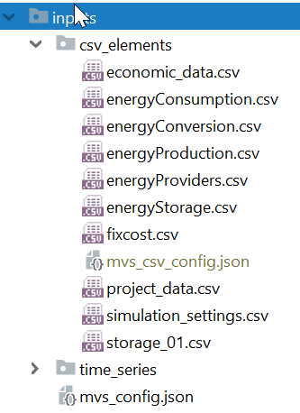
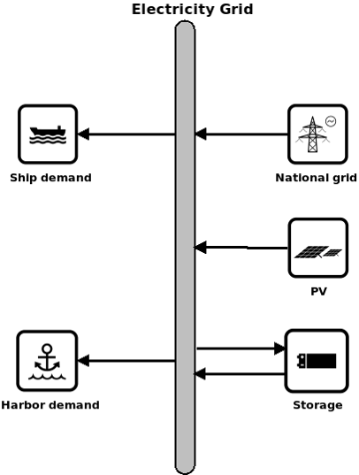
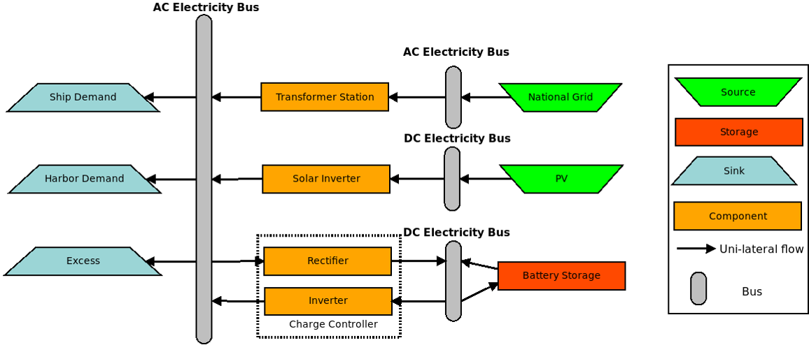

=======================
Simulating with the MVS
=======================

In the MVS can perform a capacity as well as dispatch optimisation of a specific energy system.
This means that both the capacity that is to be bought is optimised as well as the respective assets operation.
To perform an energy system simulation, a multitude of input parameters needed, which are described in link.
They include economic parameters, technological parameters and project settings.
Together they define all aspects of the energy system to the simulated and optimised.
With this, the MVS builds an energy system model which is translated to an equation system which is to be solved.
The MVS tries to minimise the annual costs of demand supply.

In this section, we want to provide you with all information needed to run your own optimisations.
First we will explain the two input types, json and csv,
and then how to make an energy system model out of your real local energy system configuration.

Input files
-----------

All input files stored in a specifically formatted input folder.
The path to the input folder is up to you.

There are two options to insert all input data – Json and CSV. These will be explained below.

Json file: mvs_config.json
##########################

In combination especially with the planned graphical user interface for the MVS (EPA),
a json file will be used to store and provide all input data necessary to understand relation.
The Json file itself is created by the EPA, ie. there are no manual changes.
You can use a specific Json input file if you want to test a simulation that has been made public online,
one test simulation, or as a developer that has knowingly edited the Json file.

As this requires to adhere to quite specific formatting rules,
this can really only be recommended for advanced users.

There can only be a single Json file in your input folder.
As some parameters in the Json file link to a time series provided as a CSV,
the folder "time_series" should be present in your input folder
and provide all necessary input data that is an timeseries format.
This can include for example PV generation time series demand time series.

Csv files: csv_elements folder
##############################

Usually user, that is not using the MVS in combination with the EPA,
will use CSV input files to define the local energy system, and respectively, the scenario.

Specifically, the MVS will create a Json file ("mvs_csv_config.json") from the provided input data,
that works just like above described "mvs_config.json".
For that, each of the following files have to be present in the folder "csv_elements":

- `economic_data.csv <https://github.com/rl-institut/mvs_eland/blob/dev/inputs/csv_elements/economic_data.csv>`_ - Major economic parameters of the project
- `energyConsumption.csv  <https://github.com/rl-institut/mvs_eland/blob/dev/inputs/csv_elements/energyConsumption.csv>`_ - Energy demands and paths to their time series as csv
- `energyConversion.csv <https://github.com/rl-institut/mvs_eland/blob/dev/inputs/csv_elements/energyConversion.csv>`_ - Conversion/transformer objects, eg. transformers, generators, heat pumps
- `energyProduction.csv <https://github.com/rl-institut/mvs_eland/blob/dev/inputs/csv_elements/energyProduction.csv>`_ - Act as energy "sources", ie. PV or wind plants, with paths to their generation time series as csv
- `energyProviders.csv <https://github.com/rl-institut/mvs_eland/blob/dev/inputs/csv_elements/energyProviders.cs>`_ - Specifics of energy providers, ie. DSOs that are connected to the local energy system, including energy prices and feed-in tariffs
- `energyStorage.csv <https://github.com/rl-institut/mvs_eland/blob/dev/inputs/csv_elements/energyStorage.csv>`_ - List of energy storages of the energy system
- `storage_01.csv <https://github.com/rl-institut/mvs_eland/blob/dev/inputs/csv_elements/storage_01.csv>`_ - Technical parameters of each energy system
- `fixcost.csv <https://github.com/rl-institut/mvs_eland/blob/dev/inputs/csv_elements/fixcost.csv>`_ - fix project development/maintenance costs (should not be used currently)
- `simulation_settings.csv <https://github.com/rl-institut/mvs_eland/blob/dev/inputs/csv_elements/simulation_settings.csv>`_ - Simulation settings, including start date and duration
- `project_data.csv <https://github.com/rl-institut/mvs_eland/blob/dev/inputs/csv_elements/project_data.csv>`_ - some generic project information

When defining your energy system with this CSV files,
please also refer to the definition of parameters that you can find here:
`stable <https://mvs-eland.readthedocs.io/en/stable/MVS_parameters.html>`_
/ `latest <https://mvs-eland.readthedocs.io/en/latest/MVS_parameters.html>`_.

Defining an energy system
-------------------------

When you energy system you basically have to fill out the CSV sheets that are provided in the folder "csv_elements".
For each asset you want to add, you have to add new column.
If you do not have an asset of a specific type,
simply leave the columns empty (but leave the columns with the parameter names and units).

The unit columns also tell you what type of information is required from you (string, boolean, number).
In case doubt, also consider the parameter list that is linked above.
Do not delete any of the rows of the CSV´s – each parameters needed for the simulation.
There will also be warnings if you do so.

Building a model from assets and energy flows
#############################################

Simulating an energy system with the MVS requires a certain level of abstraction.
In general, as it is based on the programming framework oemof,
it will depict the energy system only as linearized model.
This allows for the quick computation of the optimal system sizing and approximate dispatch,
but does not replace operational management.

The level of abstraction and system detail needed for an MVS simulation will be explained based on an exemplary local energy system.
Let's assume that we want to simulate an industrial site with some electrical demand, the grid connection, a battery as well as a PV plant.
A schematic of such a system shown below.

We can see that we have an electricity bus, to which all other components are connected,
specifically demand external electricity supply and the local assets (battery and PV).
However even though all those components belong to the same sector,
their interconnection with the electricity bus or here the electricity grid could be detailed in the deeper manner.

As such, in reality, the battery may be on an own DC electricity bus,
which is either the separate from or identical to the DC bus of the PV plant.
Both DC busses would have to be interconnected with the main electricity bus (AC) through an inverter,
or in case of bi-directional flow for the battery with an rectifier as well.

Just like so, the DSO could either be only providing electricity also allowing feed in,
or the demand may be split up into multiple demand profiles.
This granularity of information would be something that the MVS model requires to properly depict the system behaviour and resulted optimal capacities and dispatch.
The information fed into the MVS via the CSV's would therefore define following components:

Ideally you scratch down the energy system you want to simulate with the above-mentioned granularity
and only using sources, sinks, transformers and buses (meaning the oemof components).
When interconnecting different assets make sure that you use the correct bus name in each of the CSV input files.
The bus names are defined with *input_direction* and *output_direction*.
If you interconnect your assets or buses incorrectly the system will still be bought but the simulation terminated.
If you're not sure whether or not you build your system correctly change the parameter *plot_networkx_graph* in the simulation_settings to True.
When executing the simulation, the MVS were now generate a rough graphic visualisation of your energy system.
There, all components and buses should be part of a single system - otherwise you misconfigured your energy system.

Adding a timeseries for a parameter
###################################

Sometimes you may want to define a parameter not as a scalar value but as a timeseries.
This can for example happen for efficiencies (heat pump COP during the seasons),
energy prices (currently only hourly resolution), or the state of charge
(for example if you want to achieve a certain stage of charge of an FCEV at a certain point of time).

You can define a scalar as a timeseries in the csv input files (not applicable for `energyConsumption.csv`),
by replacing the scalar value with following dictionary:

    {'value': {'file_name': 'your_file_name.csv', 'header': 'your_header'}, 'unit': 'your_unit'}

The feature was tested for following paramters:

- energy_price

- feedin_tariff

- opex_var

- efficiency

You can see an implemented example here, where the heat pump has a time-dependent efficiency:

.. csv-table:: Example for defining a scalar parameter as a timeseries
   :file: tables/example_scalar_as_timeseries_energyConversion.csv
   :widths: 70, 30, 50, 50, 50, 50
   :header-rows: 1

The features were integrated with `Pull Request #63 <https://github.com/rl-institut/mvs_eland/pull/63>`_.
For more information, you might also reference following issues:

- Parameters can now be a timeseries (eg. efficiency of a converter, electricity prices)
(`Issue #37 <https://github.com/rl-institut/mvs_eland/issue/37>`_,
`Issue #82 <https://github.com/rl-institut/mvs_eland/issue/82>`_)

Using multiple in- or output busses
###################################

The features were integrated with `Pull Request #63 <https://github.com/rl-institut/mvs_eland/pull/63>`_.
For more information, you might also reference following issues:

- Parameters can now be a list of values, eg. efficiencies for two busses or multiple input/output vectors
(`Issue #52 <https://github.com/rl-institut/mvs_eland/issue/52>`_)

- Parameters can now be defined as a list as well as as a timeseries
(`Issue #52 <https://github.com/rl-institut/mvs_eland/issue/52>`_, `Issue #82 <https://github.com/rl-institut/mvs_eland/issue/82>`_ )